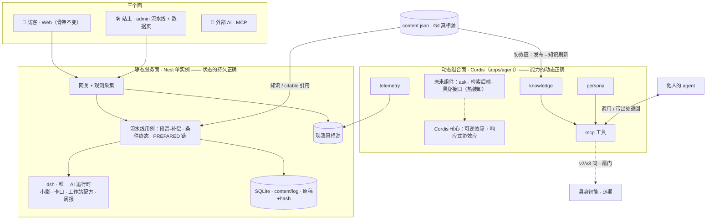

# PLAN.md — 主执行计划

> 本文件是全项目的**主计划**：定顺序、定规则、定边界、记录想法。原子任务细节在三个执行清单里（见 §9 索引），本文件只管「先做什么、不做什么、为什么」。
> 建立于 2026-09-06（HEAD `1f80393` 部署验证后）。主线排期或宪法条款变更须回写本文件。

---

## 0. 北极星

- **原子**：站主被实践检验过的判断 × 真实他人的真实需要 = 一次相遇。其余一切（框架、运行时、面板）都是会通缩的生产资料；只有判断与信任升值。
- **心脏**：循环——信号 → 分析 → 选题 → 创作 → 审批 → 发布 → 回灌（知识与引用自动更新）。**至今转过 0 次。**
- **当前唯一优先**：让循环转过第一次。不是更多文章、不是更完善的系统，是一篇真实初稿走完全链并发布。
- **时钟**：验证盒 2026-09-03 起算 14 天，**9 月 17 日到期**。它度量真实使用，不度量系统完备度。

## 1. 五条宪法（改任何东西前先过这五条）

1. **真相源分工**：公开内容归 Git（content/log），过程数据归 SQLite，原稿归文件 + hash。三者可分存，状态定义必须一致可恢复。
2. **单实例**：一台盒子、一个 Nest、一个 dsh 常驻。无证据不引入第二实例、消息队列、外部监控栈、向量库。
3. **aiUsePolicy 是机器世界的权限宪法**：readable/citable/actionable 决定一切 AI 面（小影、卡口、判断代理、远期具身）能碰什么，无例外出口。
4. **诚实降级**：AI 可关；失败如实标注（aiUsedFlag / degradeReason）；引用必须带出处——对人和对机器调用方一视同仁。
5. **判断的定价权在人**：主选、审批、发布永远是站主的点击；AI 只起草和建议。

## 2. 架构边界（论文 arXiv:2608.25512 + 实测定案 · 完整图面见 [`docs/ARCHITECTURE.md`](./docs/ARCHITECTURE.md)）

**最终架构（定稿图）：**

- **两面**：
  - **静态服务面**（Nest，单实例）——状态的持久正确。业务层手工时间可组合性：配额预留-补偿、条件终态（setStatusUnless）、PREPARED→PUBLISHED 链。
  - **动态组合面**（Cordis，`apps/agent`）——能力的动态正确。可逆效应 + 反应式协效应；knowledge 插件对 content.json 声明协效应（发布→知识反应式刷新）；组件可热装卸不腐化状态。
- **三层中心规则**：进程内去中心（组件平等、无上帝对象）；机器间中心（一盒一份真相源）；访问层去中心（Web / llms.txt / MCP 开放协议——所有权集中、访问开放）。
- **骨架不换**：现有服务迁移 Cordis 已否决，不重议。Cordis 只以新建组合进入。

## 3. 主线排期（当前有效）

| # | 事项 | 谁 | 量级 | 验收锚点 | 状态 |
|---|---|---|---|---|---|
| 1 | 观测 P0：遥测代码级关闭 + dsh 会话 90 天清理脚本 | agent | 0.5d | TODO-OBSERVABILITY P0 三项 | ✅ 生产 |
| 2 | dsh 换工作站 AGENT_RUNNER + 集成测 | agent | 1d | 生产配方可跑；假 runner 全链测试过 | ✅ 生产（含两次根因修复，详见 TODO-MAINLINE M2 实录） |
| 3 | **★ 一篇真实初稿走完全链**（创建→加工→刷新审阅→批准→发布→线上验证） | **站主** | 站主 0.5d | 文章进 content/log，线上可访问，循环计数 0→1 | **心脏** |
| 4 | 共创文案三句 + 周报建议一键转题苗 | agent | 1d | 卡口/小影回执文案上线；建议可生成题苗草稿 | ✅ 生产 |
| 5 | admin 流水线视图（九页并五，流水线默认首页） | agent | 1–2d | 池→苗→作→品单视图可追踪 | ✅ 生产 |
| 6 | 判断代理 v1（apps/agent · Cordis · MCP） | agent | 1–2d | TODO-AGENT A0–A6；dogfooding 实录 | **A0–A3 ✅ A4 stub**（2026-09-06 提前解冻）；余 A5 dogfooding / A6 文档收尾 |
| 7 | 观测 P1（token/首字延迟/排队/降级原因落库） | agent | 1–2d | 线上真发一问，AssistantRun 新列有值 | 初稿后 |
| 8 | 验证盒复盘 | 站主+agent | 0.5d | **9 月 17 日**，拿真数据说话 | 已定日程 |

> **2026-09-06 优先级变更（站主指令）**：主线于 M2 完成后暂停（生产已一致运行 `44d026e`：dsh runner + 遥测关闭生效），**判断代理脚手架提前解冻并完成**（A0–A3 + A4 stub，详见 `docs/TODO-AGENT.md` 实录）。冻结条款对 M4/M5 维持；主线恢复点 = M3（站主初稿）。

分工一句话：**站主出判断和初稿，agent 出其余所有代码**；站主每天用自己的站一次——当第一个真实访客。

## 4. 冻结条款

- **第一篇发布前**：不启动判断代理编码、不接入任何新的基础设施想法。新想法只记账（§7），不排期。对站主和 agent 同等生效。
- 主线任何一步卡住超过 2 天 → 降级完成该步的最小版本继续推进，不允许用插入支线来回避。
- 理论（论文/框架/范式）不 override 实践：先让循环转过，组合面的语义才有数据可服务。

## 5. 明确不做（当前有效）

P2 数据页（等数据存在）、观测 P3 全部（按触发条件）、Cordis 迁移（已否决）、路由拆包、前端点击流、自建 PV、OTLP/外部监控栈、向量检索、分布式/多实例、微体站网络与点子社区（VISION 远格）。

## 6. 支线停车场（记账不排期）

| 支线 | 解冻触发 |
|---|---|
| 判断代理 v2（HTTP 公网 + ask 工具） | 外部真实用户或自用高频缺口 |
| session-stats 用户层挂载 | 网关折算不够（需 step 级细分） |
| token → 成本折算 | token 数据满一个月 |
| 洞察周报 token 采集 | 周报成为每周例行 |
| 工作站迁入 Cordis 组合面 | 工作站成为长驻编排器（热装卸真需求出现） |
| 具身 | 只保留写作习惯：方法论写成带步骤的行动指南 |

## 7. 想法记录（新想法先落这里，只记不排）

- （空；按日期追加，一行一条，注明来源会话）

## 8. 状态快照（2026-09-06 · 主线 M1–M5 完成日）

- **已完成并部署**：T0–T4 优化批（`1f80393`）→ 观测 P0 + dsh 统一 runner（`44d026e`）→ 判断代理脚手架（`ec650c2`）→ 降级日志+api.log（`bbffd9c`）→ **M4 共创/转题苗 + M5 流水线 + 双合同超时修复（完成部署批次）**。
- **生产 AI 实况**：小影真答恢复（aiUsedFlag=true 实测）；卡口 nextStep 随完成部署恢复 AI（双合同超时根因已修：短调用 prompt 原样透传，A/B 探针 7.2s vs 45.8s）；工作站配方生产可用（dsh）。
- **生产事故记录（如实）**：09-06 部署中断引发半重启进程，助手+卡口一度规则兜底（窗口 14:50–23:15 UTC）；处置 = api.log 落盘 + 降级原因日志，复发可诊断。
- **主线状态**：M1✅ M2✅ M3-1✅（M3-2~4 待站主初稿——唯一剩余主线项）M4✅ M5✅；M6 判断代理 A0–A3✅A4stub；M8 复盘 9/17。
- **已备资产**：dsh 全历史 clone / pi clone / 参考仓库与 tarball（~/Desktop/agent-runtime-backup，含 MANIFEST）。
- **循环计数**：完成并被检验的交付 = **0**（等站主初稿）；公开文章 28 篇；验证盒剩余 **11 天**。

## 9. 文档索引

| 文件 | 职责 |
|---|---|
| `docs/TODO-MAINLINE.md` | 主线 M2/M3/M4/M5/M8 原子任务（M1→OBS·P0，M6→AGENT，M7→OBS·P1 交叉引用） |
| `docs/TODO-OBSERVABILITY.md` | 观测与数据（P0–P3，原子任务） |
| `docs/TODO-AGENT.md` | 判断代理 v1（A0–A7，四插件架构） |
| `docs/TODO-OPTIMIZATION.md` | 2026-09-05 分析的 T0–T4 优化批（已完成，留档） |
| `docs/STATUS.md` / `docs/ENGINEERING.md` / `docs/api/README.md` | 生产状态 / 工程事实 / API 契约 |
| `ops/windows/README.md` | 盒子运维：部署验证清单、备份恢复、runtime |
| `docs/PRD-SITE-ASSISTANT.md` | 站内助手 PRD 与技术决策 |
| `AGENTS.md` / `CLAUDE.md` | 项目级 agent 指令 / 工程约定 |
