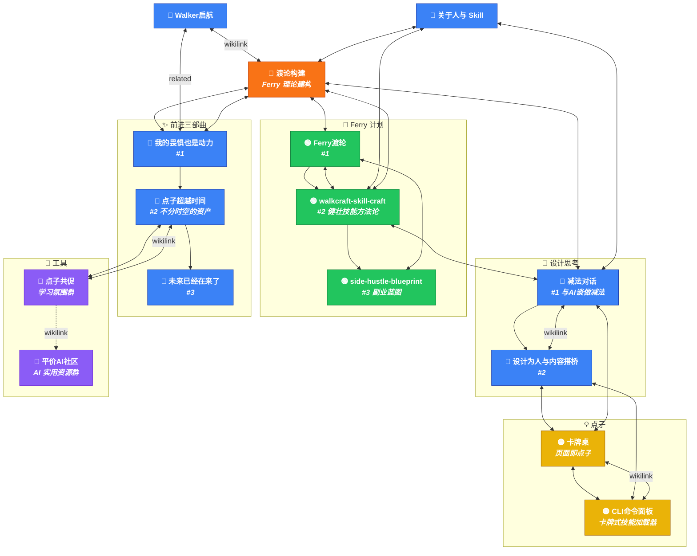
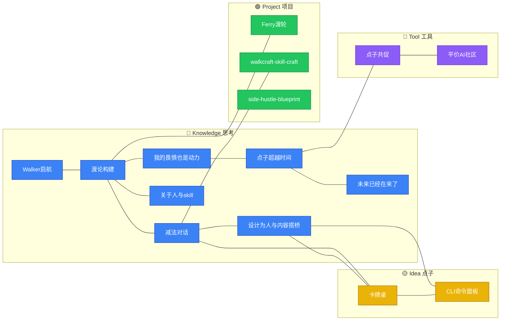

# 内容关系图谱

> 按 `type` 着色：🔵 knowledge · 🟢 project · 🟡 idea · 🔧 tool

## 全景图

## 按类型的关联矩阵

## 统计

| 指标 | 数量 |
|------|------|
| 内容文件总数 | 15 |
| 🔵 knowledge | 8 |
| 🟢 project | 3 |
| 🟡 idea | 2 |
| 🔧 tool | 2 |
| 系列数 | 3（Ferry计划 / 前进三部曲 / 设计思考） |
| 关联边数 | ~25（related + wikilink） |

## ⚠️ 悬空链接

以下 wikilink 在 Vault 中找不到对应文件：

| 链接 | 出现在 |
|------|--------|
| `[[nl-programming]]` | 设计为人与内容搭桥 |
| `[[AI 实用资源群]]` | 点子超越时间（实际文件名是 `平价AI社区`） |

## 📌 枢纽排名（按连接数）

1. **渡论构建** — 7 条连接，全网核心
2. **减法对话** — 6 条连接，设计 ↔ Ferry 桥梁
3. **我的畏惧也是动力** — 5 条连接，三部曲起点
4. **Ferry渡轮** / **walkcraft-skill-craft** — 各 4 条，项目核心
