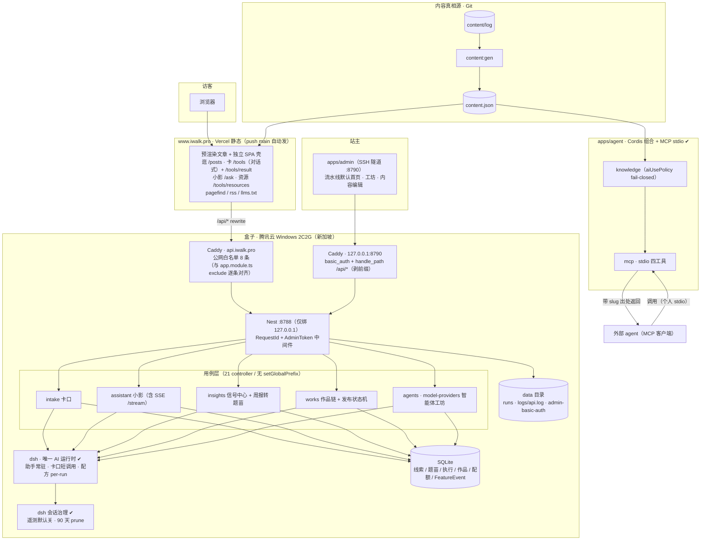
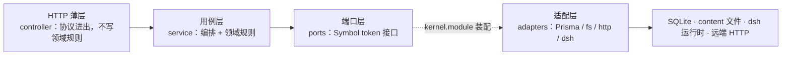
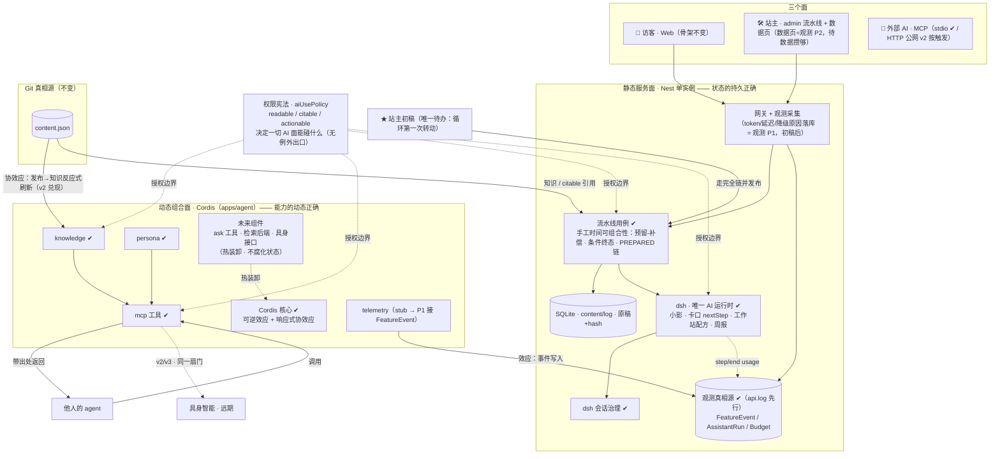
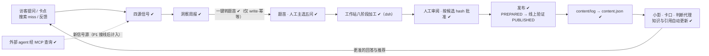

# 架构（权威）：当前态 · 最终态 · 演进对照

> 本文件是全项目架构的唯一权威图面；边界规则原文在 [`PLAN.md`](../PLAN.md) §2（五条宪法同在彼处）。
> 更新纪律：拓扑/组件/数据流变更须回写本文件；图中状态标注随部署实况更新。
> 基准：2026-09-14 · 本地工作区 as-built（生产基线：2026-09-03 切流 + 2026-09-09 智能体工坊上线）。

## 一、当前架构（as-built 2026-09-14）

### 1.1 运行拓扑（部署视角）

**接入约定（勿踩）**：`api/` 前缀由接入侧补——生产 Caddy `handle_path /api/*` 与开发期 vite `rewrite` 都会剥掉 `/api` 再转发，因此 **controller 一律不自带 `api/` 前缀**（health 走 `/health`，其余走 `/clues`、`/agents`…）。公网白名单是双侧同步：`apps/api/src/app.module.ts` 的 exclude 表 + `ops/windows/Caddyfile`，漏一侧即 401/404。

### 1.2 代码分层（依赖方向）

- **依赖方向**：controller → service → port ← adapter；新增能力先定 port 再写 adapter，接线只在 `kernel.module.ts`。
- **Nest DI**：接口 token 必须显式 `@Inject(TOKEN)`（`tsx` 下无 `emitDecoratorMetadata`，裸类型参数会注入成 `undefined`）。
- **AI 双实现**：AI 策略（`AiNextStepAdapter` / `HarnessAssistantAdapter`）与规则兜底（`RuleNextStepAdapter` / `RuleAssistantAdapter`）同在适配层；**站主面（`DshAgentRunner` 配方）无兜底，失败如实抛错**。
- **内容真相源唯一**：`content/log` →（`scripts/generate-content.ts`）→ `apps/web/src/generated/content.json`，被 web 打包、api 内容索引、agent 知识库、预渲染与 feeds 共同消费。

## 二、最终架构（定稿 · 2026-09-06 论文修订版）

## 三、循环飞轮（最终架构的心脏）

**循环状态：全链每一环都已建成并通过测试/生产验证——只差第一次真实转动（★站主初稿）。**

## 四、边界规则与不变式（原文见 PLAN §1/§2）

- **两面**：静态服务面（Nest·状态的持久正确：预留-补偿/条件终态/PREPARED 链）｜动态组合面（Cordis·能力的动态正确：可逆效应+反应式协效应）。
- **三层中心规则**：进程内去中心（组件平等）；机器间中心（一盒一份真相源）；访问层去中心（Web/llms.txt/MCP 开放协议）。
- **骨架不换**：现有服务迁移 Cordis 已否决；Cordis 只以 `apps/agent` 新建组合进入。
- **权限宪法不可绕过**：`aiUsePolicy`（readable / citable / actionable）是所有 AI 面（小影、卡口、判断代理、远期具身）的唯一授权来源；判断的定价权在人（主选/审批/发布永远是站主点击），AI 只起草和建议。

## 五、演进对照（当前 → 最终）

| 组件 | 状态 |
|---|---|
| AI 运行时统一（dsh 四用例） | ✔ 生产（小影/卡口 AI 实测真答；配方可用） |
| 卡口/工作站 codex 退役 | ✔ |
| 观测 P0（遥测关闭/会话治理/api.log） | ✔ 生产 |
| 共创显性化 + 周报转题苗 | ✔ 生产（本批） |
| admin 流水线默认首页 | ✔ 生产（本批） |
| 智能体工坊（agents + model-providers + 文件直调） | ✔ 生产（2026-09-09 上线；2026-09-13 修正 controller 路由前缀与 Nest DI 显式注入） |
| 卡口形态：向导 → 对话式 | ✔ 本地（`/tools` 一问一答 + `/tools/result` 深链，noindex） |
| 判断代理 v1（Cordis+MCP stdio） | ✔ 脚手架（A0–A3；A4 stub；A5 dogfooding 待站主） |
| 观测 P1（token/延迟/降级原因落库） | 待初稿后 |
| 数据页三标签（观测 P2） | 待数据攒够 |
| 判断代理 v2（HTTP 公网/ask/反向挂载） | 按触发 |
| ★ 站主初稿全链 | **唯一待办（人）** |
| 具身 | 远期（同一 MCP 接口消费） |
