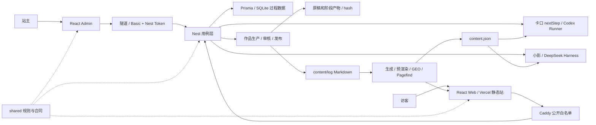

# AdgaiWalker 项目完整分析

审查日期：2026-09-05。基线：`6b5a5cb`。本报告覆盖产品、架构、数据、前后端、AI、安全边界、内容发布、部署与验证；结论来自实际源码、测试、构建、隔离复现和公开只读探针。

## 总体判断

**项目已有可运行的公开内容站和 AI 服务基础，但站主生产闭环仍有明确断点，公开执行边界也有一项应立即修复的高危问题。适合继续沿现有架构收敛，当前不宜把“功能已接线、测试全绿”当作“完整生产闭环已成立”。**

最优先处理 Windows shell 接收公开用户文本的问题。随后恢复题苗主选、工作站审核与文章发布三段主链，保护 Admin 尚未发布的内容，再统一助手会话、流式、取消和等待的契约。

## 架构地图

这里有两类不同的数据真相：Markdown/Git 管公开内容，SQLite 管线索、题苗、执行、会话、作品和发布状态。文件系统另外保存原稿、阶段产物和发布准备包。它们可以分开存储，但“已保存、已审批、已发布、已完成”必须有一致且可恢复的定义。

### 各部分目前承担什么

| 部分 | 实际职责 | 评价 |
|---|---|---|
| `apps/web` | 阅读、内容分类、卡口、小影、搜索、点赞和反馈 | 静态内容链成熟度最高；互动链还有运行时边界缺口 |
| `apps/admin` | 线索/题苗/执行/指标、内容编辑、问题池、凭据、作品工作台 | 已连真实 API，但主选、审核恢复和产出展示未形成完整日常操作链 |
| `apps/api` | Nest 用例、鉴权、持久化、AI 编排、生产与发布 | ports/adapters 结构清楚；跨状态与跨存储提交仍分散 |
| `packages/shared` | 领域词汇、输入规则、AI 输出合同、闭环计算 | 双端复用有效；部分新增必填合同未覆盖旧调用方 |
| `scripts` | 内容生成、预渲染、SEO/GEO、发布与探针 | 有实际门禁；发布脚本、生成器与校验器存在契约不一致 |
| `ops/windows` | 单机 API、Caddy、运行时与计划任务 | 符合资源约束；恢复与部署保护主要靠人工记忆 |

产品口径的“小影与卡口是一个 Agent 的两张面”，在实现上仍是两套执行路径：小影走 Harness，卡口走 `AiNextStepAdapter → CodexAgentRunner`，管理作品加工也复用后者。这个区别直接影响安全、成本和取消能力，不能假定改好小影就同时改好了卡口。

## 审查边界与方法

起始工作树干净。审查过程中其他任务开始修改 insights、schema、导航等内容；本报告不把这些未提交的新功能作为缺陷，也不覆盖它们。统计和验证结果对应本次检查时点的基线。

三个并行子审查分别覆盖 API/shared、web/admin、内容/部署，主审对高影响问题重读调用链并复核。采用六个视角：产品任务能否完成、状态所有权、安全与策略边界、模块信息隐藏、错误恢复、部署与验证证据。

本次没有部署、提交、推送或修复业务代码；没有进行生产攻击测试、真实 AI 压测或管理端生产写入。公开站首页的浏览器可访问性树已读；截图和进一步 UI 操作因浏览器工具超时未完成，不据此声称移动端或全站视觉验收通过。

常规 `test:api` 会按仓库配置加载 API 环境并向所配置数据库写测试数据，真实库集成组本次执行了 5 项；该测试没有清理逻辑。本次沿用了这个测试配置，没有另行读取业务数据或清理数据库。后续应先改为独立测试库。构建只产生时间戳变化的 `content.json` 已在确认内容完全相同后恢复。

## 产品现状与成熟度

项目要验证的是：**真实问题进入 → 用知识形成下一步 → 人选择值得做的事 → 交付 → 检验 → 回灌内容。** 这条价值链比后台页面数量更有意义。

| 用户任务 | 当前证据 | 判断 |
|---|---|---|
| 读证据、找文章 | 27 篇文章预渲染，时间流/标签/专题/目录/版本链与搜索均有实现 | 可以作为产品稳定基础 |
| 向小影了解站主与内容 | 独立页、浮窗、SSE、多轮、引用和规则兜底已实现；健康接口 AI 开关为 true | 功能已上线，质量、成本与会话安全仍需独立验收 |
| 卡住时拿 nextStep | 规则和 AI 双策略、线索落库、匿名配额已实现 | 公开命令边界及并发一致性优先修复 |
| 站主从线索主选到执行 | 页面仍发旧合同，后端要求新增 brief | 现有主选页面无法完成关键步骤 |
| 人工初稿变成可发布作品 | 原稿保护、阶段产物、hash 审批和准备包已有实现 | 审核、刷新恢复、元数据和发布阶段仍有断点 |
| 公众号分发 | 默认接入 `UnavailableWechatDraftSession`，可产出准备包并等待人工 | 不能等同于公众号草稿已保存或文章已发布 |
| 账号、多租户、社区网络 | 属延后范围 | 不属于本轮缺失功能，不建议提前补齐 |

本次构建扫描 29 个内容文件，生成 28 个公开条目：15 knowledge、5 idea、5 project、2 learn、1 tool。27 个 browse 条目成为文章。18 个非项目内容的空 `status` 不是缺陷，不能强套项目推进状态。

首页最新入口已偏向“小影 + 逛”，卡口为次入口。这是已有产品决策，应同步现行 PRODUCT，而不是机械恢复旧布局。管理端同时存在今日、过程四面、工作站、内容和系统工具，接下来的产品工作应让默认视图围绕待处理任务收敛，减少站主在多页之间搬运状态。

目前没有核验真实访客量、有效回答率、题苗转化或交付收益，因此不能给出产品市场契合度结论。建议用“有效下一步、可追踪题苗、完成并被检验的交付”验证价值；点赞和页面数量只能作辅助信号。

## 复杂度中心

**复杂度集中在跨层的执行与完成状态，而不是文件太长。**

一项操作需要同时理解：浏览器临时 hash、后端工作状态、文件产物、Git 提交、Vercel 部署，以及远端可见性。助手则把访客身份留在用例层，把 session 和进程留在 runner，把停止留在浏览器，把最终校验留在回答末尾。局部模块都能运行，组合后的不变量没有统一保证。

这是实际的变更扩散：新增 ContentBrief 会改变老主选页面；新增流式会改变引用校验与停止语义；新增工作站发布会碰到已有内容构建门禁。继续只给每一层补局部条件，会让下一次功能修改更难判断影响范围。

### 两种可行方向

| 方案 | 改动 | 收益 | 成本与限制 |
|---|---|---|---|
| **推荐：保留 monorepo，补齐关键合同** | 安全 runner；服务端会话归属；原子 intake；从 review 包恢复候选；统一发布元数据与阶段状态 | 边界更明确，改动可逐项验证，符合单人维护和单实例部署 | 仍需处理文件与数据库之间的补偿 |
| 更强的持久运行模型 | 增加 runId/version、条件状态转换、持久执行摘要与产物版本，公开推理和管理执行分端口 | 重启、取消、并发和跨设备恢复更可靠 | 合同与数据迁移更多，应在第一方案后按实际任务压力推进 |

不建议继续原样扩功能，因为主链断点已出现；不建议只拆组件或增加通用 Manager，因为不会修复状态归属；不建议把规则并回页面或 controller，因为会扩大协议耦合。现在没有证据要求引入微服务、Redis、向量库或更换前端框架。保留单实例，同时把关键写入和生命周期做正确，收益更高。

## 排序后的主要发现

以下 P 编号为问题序号；严重级别另列。源码可确认、隔离复现与尚未核验的线上影响分别说明。

### P1：公开用户文本进入 Windows shell — 高，首先处理

调用链为 [intake.service.ts:124](/Users/happy/Desktop/AdgaiWalker/apps/api/src/intake/intake.service.ts:124) → [ai-nextstep.adapter.ts:74](/Users/happy/Desktop/AdgaiWalker/apps/api/src/adapters/ai-nextstep.adapter.ts:74) → [codex-agent.runner.ts:32](/Users/happy/Desktop/AdgaiWalker/apps/api/src/adapters/codex-agent.runner.ts:32)。最后一个模块把完整用户 prompt 放入 args，并在 Windows 上启用 `shell:true`。

本地无害验证只拦截 Node 底层 spawn 参数，没有启动子进程：Windows 分支确实拼出 `cmd.exe /d /s /c` 命令，用户文本中的 shell 分隔符未转义。Node 官方明确说明，这种用法可能导致任意命令执行。[Node.js child_process 文档](https://nodejs.org/api/child_process.html#child_processspawncommand-args-options)

触发前提是 Windows、AI 开启、可写存储和可用游客配额。生产健康探针显示 AI 开启，仓库部署记录为 Windows，但本次未核验服务器精确构建，也未执行生产利用，不能据此断言服务器已被攻击。Codex 的 read-only 参数在 shell 解析之后才生效，不能保护这一层。

**建议：** 由 runner 直接启动真实 executable/Node 入口，使用 `shell:false`；prompt 走 stdin 等数据通道。不要让每个调用方自己负责 shell 转义，更不要用字符黑名单代替数据/命令分离。进一步可把公开纯问答与管理代码执行分开，但无需先重写后端。

### P2：正常 Admin 页面无法完成题苗主选 — 高

[SeedsPage.tsx:71](/Users/happy/Desktop/AdgaiWalker/apps/admin/src/pages/SeedsPage.tsx:71) 只提交 seedId 与 clueId；[admin-api.ts:122](/Users/happy/Desktop/AdgaiWalker/apps/admin/src/api/admin-api.ts:122) 不会补 brief；controller 原样转发。而正常 Kernel 已注入 ActionRepository，[seed.service.ts:118](/Users/happy/Desktop/AdgaiWalker/apps/api/src/seed/seed.service.ts:118) 在存在 actions 时强制要求 brief。

因此站主点击“主选”会得到 `content-brief-incomplete`，无法推进到执行。两个独立审查均确认没有其他页面逻辑自动补齐。带 brief 的直接 API 可以成功，不代表现有页面主链可用。

**建议：** 主选任务采集并共享校验完整 brief，迁移全部调用者。不要依赖可选 DI 暗中切换新旧产品规则。集成测试目前手工构造 SeedService 时漏注入 actions，恰好走了旧分支；应以真实 Nest 接线验证这个流程。

### P3：工作站生成的文章不能直接通过本站构建 — 高

[publication.service.ts:44](/Users/happy/Desktop/AdgaiWalker/apps/api/src/workflow/publication.service.ts:44) 生成的 frontmatter 仅含 title/date/type/published/summary，缺少 `form/domain/intent/valueMode/aiUsePolicy/updated` 六项。[check-content-fields.ts:11](/Users/happy/Desktop/AdgaiWalker/scripts/check-content-fields.ts:11) 明确要求这些字段，而它是 build:web 的第一步。

这意味着正常工作站“网站发布”写出的新文章，经后续 Git 上线时会阻断构建。该服务还直接写 files.save 后立即检查线上 URL，没有完成 gen/commit/push/等待部署的流程。线上 verifier 能避免把多数新文章假报成功，但不能替代真正发布链路。

**建议：** 让发布器和内容门禁使用同一份公开文章合同；在写文件前验证元数据。把准备文件、提交、部署中、已验证发布明确分开，页面返回可定位的产物/URL/失败原因。不要放宽构建门禁来迁就不完整的生成物。

### P4：内容保存与 Git 发布/部署的边界会丢改动或夹带代码 — 高

第一条风险来自 [AGENTS.md:35](/Users/happy/Desktop/AdgaiWalker/AGENTS.md:35) 的脏树处理：直接 reset 到远端并称 data/env 在 Git 外所以安全。实际 [fs-content-file.repository.ts:90](/Users/happy/Desktop/AdgaiWalker/apps/api/src/adapters/fs-content-file.repository.ts:90) 默认覆盖 Git 管理的 content/log，赞赏配置也默认写在 content 内。服务器 Admin 修改已有文章但尚未提交时，照此部署会丢弃这些编辑。这里不指 SQLite 会被删除；已提交内容或明确放在外部目录时边界不同。

第二条风险来自 [content-publish.ts:118](/Users/happy/Desktop/AdgaiWalker/scripts/content-publish.ts:118)：add 限定内容路径，commit 却提交整个暂存区。隔离临时仓库实测表明，预先 staged 的无关代码会被一起提交；在 main 上 push 时可能一起上线。真实仓库 index 未用于此复现。

**建议：** 部署先检查并保护未发布内容，拒绝自动覆盖；内容提交使用明确 pathspec/独立 index，或在存在无关 staged 项时明确停止。不能仅把保护责任写进另一条运维提醒。

### P5：作品审核依赖当前页面历史，取消也不是稳定终态 — 高

[WorkstationPage.tsx:79](/Users/happy/Desktop/AdgaiWalker/apps/admin/src/pages/WorkstationPage.tsx:79) 把候选 hash 放 React 内存；[同页:138](/Users/happy/Desktop/AdgaiWalker/apps/admin/src/pages/WorkstationPage.tsx:138) 只从这份内存或 approvedArtifactHash 取值。作品 REVIEW_READY 但尚未审批时，刷新会同时隐藏 Review/Approve。后端 [review.service.ts:18](/Users/happy/Desktop/AdgaiWalker/apps/api/src/workflow/review.service.ts:18) 已能返回 candidate.hash，页面却把读取入口挡在“先知道 hash”之后。

即使进入 Review，[WorkstationPage.tsx:162](/Users/happy/Desktop/AdgaiWalker/apps/admin/src/pages/WorkstationPage.tsx:162) 也只展示部分原稿、hash、风险/编辑 JSON 和有无封面的布尔提示，没有完整候选正文，Approve 却可直接点击。服务器批准绑定 hash 的设计是对的，人工审阅界面没有完成配套任务。

取消方面，[production.service.ts:96](/Users/happy/Desktop/AdgaiWalker/apps/api/src/workflow/production.service.ts:96) 在最后阶段结束后无条件写 REVIEW_READY。隔离复现得到 `PROCESSING → CANCELLED → REVIEW_READY`；runner 没收到取消信号，同 work 也缺运行互斥。

**建议：** Review 按 workId/状态可进入，候选版本从服务端审阅包恢复；展示完整候选和平台预览后按其 hash 审批。生产引入每 work 的运行标识和条件状态更新，取消后迟到结果不能覆盖终态。先做这些，不要用 localStorage 缓存 hash 作为补救。

### P6：助手会话归属缺少校验 — 中，涉及隐私边界

[harness-assistant.adapter.ts:189](/Users/happy/Desktop/AdgaiWalker/apps/api/src/adapters/harness-assistant.adapter.ts:189) 将客户端 sessionId 直接用于续轮，并因此跳过首轮知识与人设包；visitorKey 没被用于授权。仓储只在完成后写入 `(anonId, sessionId)`，没有在调用前查询归属。

隔离测试中，访客 B 携带 session-A 时，runtime 原样收到该 session。风险是获得他人 sessionId 后续接或污染其上下文。当前没有发现公开枚举 sessionId 的接口，未证实真实 Harness 会泄露历史文本，因此不能写成“任意读取全站对话”。

**建议：** 在服务端绑定匿名身份与运行时会话；未知、过期或不属于当前访客的会话拒绝或新开。明确区分规则会话与 Harness 会话。不需要为解决这个问题引入完整账户体系。

### P7：流式先发后验，超时与停止的定义也不完整 — 中

[harness-assistant.adapter.ts:206](/Users/happy/Desktop/AdgaiWalker/apps/api/src/adapters/harness-assistant.adapter.ts:206) 原样外发模型 text-delta，直到第 221 行才解析最终合同。隔离测试中，最终 JSON 被拒绝并降级，但此前的未校验文字已经发出。[useAssistant.ts:93](/Users/happy/Desktop/AdgaiWalker/apps/web/src/hooks/useAssistant.ts:93) 会立即显示，停止/错误还能保留非空文字。这是先发后验的合同问题，不是已经证实 XSS 或私有文档泄漏。

浏览器同时依赖模型 JSON 恰好采用紧凑的 `"answer":"` 格式；合法的冒号后空格会让流式提取为空。浮窗 [AssistantFloating.tsx:83](/Users/happy/Desktop/AdgaiWalker/apps/web/src/components/ui/AssistantFloating.tsx:83) 漏传 onStop，声明的输入 ref 也没有接到真实 textarea。

此外，[harness-assistant.adapter.ts:177](/Users/happy/Desktop/AdgaiWalker/apps/api/src/adapters/harness-assistant.adapter.ts:177) 拿到全局锁之后才开始计算 15 秒；3 个并发请求在 25ms 隔离超时下分别耗时约 26/52/78ms。排队不受端到端 deadline 约束，浏览器断流也没有取消服务端。

**建议：** 若继续遵守“完整校验后才出网关”，先缓冲校验再分块展示；若保留真实流式，应正式定义允许先发的字段、长度、消毒和未完成状态，引用只走校验后的事件。SSE 应输出稳定展示合同，避免浏览器解码模型私有格式。另补队列容量、从入队开始的 deadline 和端到端取消。

### P8：游客配额与线索写入没有原子性 — 中

[intake.service.ts:124](/Users/happy/Desktop/AdgaiWalker/apps/api/src/intake/intake.service.ts:124) 先生成回答并创建 Clue，再 consume 配额。隔离测试强制 consume=false 时，已经创建 1 条线索，返回却是配额错误。配额适配器对首次消费采用先查再 upsert，两次并发消费均可返回 true，而最终计数仍为 1。

**建议：** 将条件消费配额与创建线索合成一个业务事务；成本更严时增加预留/释放语义。不要简单交换两次写入顺序，也不要把模型调用放进长数据库事务。匿名 cookie 本身可清除，这个修复保证内部一致性，不会把匿名配额变成强身份防线。

### P9：权威文档与当前运行事实冲突 — 中

[CLAUDE.md:109](/Users/happy/Desktop/AdgaiWalker/CLAUDE.md:109)、[API 契约](/Users/happy/Desktop/AdgaiWalker/docs/api/README.md:4) 仍称管理面无令牌；[ENGINEERING.md:85](/Users/happy/Desktop/AdgaiWalker/docs/ENGINEERING.md:85) 和 STATUS 顶部仍称 API 未上线，而 STATUS 后文又记录已切流。代码已存在生产缺 token 拒启、Basic/token 校验与正式 API rewrite。

更直接的产品影响是 [ToolsPage.tsx:17](/Users/happy/Desktop/AdgaiWalker/apps/web/src/pages/ToolsPage.tsx:17) 仍向访客显示“公网没有真卡写入”的旧推测和本地启动命令。助手 TODO 已勾选 firstChunkMs、停止及部分指标，但本次所读实现 traceId 固定 null，未找到 firstChunkMs 落位。

**建议：** 重写现状摘要，而非继续往旧正文末尾追加。STATUS 正文只表示当前事实，历史记录注明日期；API 文档覆盖新增端点与真实请求体；将“代码有能力”“已上线”“当前实测通过”明确区分。

### P10：数据库迁移与内容增长的门禁有潜在断点 — 中

[schema.postgresql.prisma:196](/Users/happy/Desktop/AdgaiWalker/apps/api/prisma/schema.postgresql.prisma:196) 起的 AssistantSession/AssistantRun/AssistantBudget/Credential 四表，在已有 6 份迁移 SQL 中均无创建语句。按 [prisma-env.ts:106](/Users/happy/Desktop/AdgaiWalker/scripts/prisma-env.ts:106) 的 migrate deploy 路径部署新 PG 库，会出现 client 有模型、库没有表。当前 SQLite 的 db:push 不受这个 PG 缺口直接影响。

[emit-static-feeds.ts:109](/Users/happy/Desktop/AdgaiWalker/scripts/emit-static-feeds.ts:109) 只取前 40 篇 RSS，而 [verify-geo.ts:165](/Users/happy/Desktop/AdgaiWalker/scripts/verify-geo.ts:165) 要求条数等于全部 browse。当前 27 篇可通过；到 41 篇时构建会确定失败。

**建议：** 迁移从空 PG 库重放并检查 schema 差异；统一 RSS 上限契约。前者应在启用 PG 前完成，后者可作为小改动尽早消除。

## 代码质量与其他维护项

代码风格总体清晰，没必要因为一接口只有一个实现就删 port，也没必要因为 controller 薄就合并进 service。AgentRunner 一个运行方法、AssistantRunner 两个问答方法、SiteContentIndex 两个读取方法，确实隐藏了相当数量的进程、缓存和文件处理代码；应补齐这些接口承担的不变量。

| 级别 | 具体证据 | 改进方向 |
|---|---|---|
| 中 | [ContentAdminService:78](/Users/happy/Desktop/AdgaiWalker/apps/api/src/content-admin/content-admin.service.ts:78) 以“存在 package.json”选 cwd；本地 apps/api 没有 content:gen。只监听 spawn error，忽略非零退出 | 明确 workspace 根及生成结果；本地保存、生成、发布各自可见。生产 run-api 从根启动，不触发该特定 cwd 问题 |
| 中 | [ContentEditPage:69](/Users/happy/Desktop/AdgaiWalker/apps/admin/src/pages/ContentEditPage.tsx:69) 保存响应无条件覆盖 raw，期间 textarea 仍可编辑 | 使用编辑版本标记或保存时冻结，防止后到响应覆盖新输入 |
| 中 | [useAdminAction:15](/Users/happy/Desktop/AdgaiWalker/apps/admin/src/hooks/useAdminAction.ts:15) 吞异常返回 false；Workstation 外层 run 套 load 内层 run | 重构为一次外层错误处理，纯读取函数独立；避免内层失败被外层成功清除 |
| 中 | 工作台请求缺 pending，同次重试每次生成新 Date.now 幂等键 | 按业务操作保持稳定幂等键；让运行/停止状态来自服务端 |
| 低 | 单个 web JS 产物 553.71kB，gzip 186.18kB；所有页面静态导入，构建发出体积警告 | 稳定主链后再按路由拆包；先量首屏与交互时间，不把体积警告等同线上性能不合格 |
| 低 | 少量路由硬编码、generatedAt 每次变化、文档目录大小写不统一 | 行为保持清理，统一现有配置中心，降低无意义 diff |

上述维护重构应保持现有正确行为；前面 P1–P10 的缺陷修复则需要明确新的验收行为，两类工作不要混成一次大重构。

## 已有设计值得保留

1. **静态阅读与在线写入分离。** API 或模型异常不会让全部文章失去可读性，适合当前服务器约束。
2. **公开内容有统一生成链。** Markdown → JSON → 文章 HTML、feeds、llms、Pagefind；web 运行时只读 JSON，没有直接访问磁盘或数据库。
3. **AI 默认可退回规则。** 最终引用来自 citable 集合，来源标识存在；修复流式应保留这条安全基线。
4. **管理面有真实防线。** 公网 Caddy 方法/路径白名单与 Nest 当前一致；生产缺 token 拒绝启动，管理面回环与 Basic/token 分层。
5. **原稿与批准版本有保护。** 文件 hash、不可覆盖原稿、阶段产物、approvedArtifactHash 为可审查交付提供了正确基础。
6. **shared 纯规则已有价值。** 领域词汇、闭环判断、输入和 AI 输出校验能双端共用，应让新增合同沿着这个方向补齐。

## 运行、成本与恢复判断

单 Nest + SQLite + Caddy 对当前规模是合理选择。迁移托管 PG 应由多写进程、写锁等待、高可用或恢复要求触发，而非目录结构看起来“大”就迁移。当前两套 AI runtime 的预算、超时和取消应分别核算；助手 200 次/日的计数并不自动覆盖卡口 Codex 和管理生产。

助手预算存储失败时 fail-open 是 TODO 的明确决策，不是遗漏。但这意味着它不是故障条件下的刚性成本上限；可加进程内兜底计数，并记录预算存储失效。判断是否需要压缩 prompt 或改检索前，应先采集队列等待、首字延迟、总耗时、tokens 和降级原因。现有 28 项内容不足以证明需要向量检索系统。

仓库里未找到完整备份/恢复脚本、异机副本策略、保留周期或恢复演练记录。不能据此断言服务器没有云备份；能确认的是，从仓库无法复现恢复能力。恢复对象不能只看 SQLite：还包括加密主密钥、运行配置、原稿与阶段文件、未发布内容，以及必要的 Harness 状态。应将路径清单和实际恢复演练结果写入运行手册。

代码更新与 Vercel web 发布是两条独立发布链。除了 health，还需要可读的构建版本、实际端口进程、db 状态和路由隔离结果，才能判断新版本确实在服务。现有 probe 脚本主要打印状态，不是完整自动发布门禁。仓库中未找到 `.github` 工作流；外部 CI 和分支保护未核验。

## 验证结果与证据边界

| 验证 | 本次结果 |
|---|---|
| `pnpm typecheck` | 通过，覆盖 shared、api、admin、web 和 scripts |
| `pnpm test:shared` | 10 文件，53 项通过 |
| `pnpm test:api` | 27 文件，90 项通过，包括 5 项真实库集成测试 |
| `pnpm test:web` | 19 文件，74 项通过 |
| `pnpm --filter @walker/admin test` | 2 文件，4 项通过 |
| 合计 | **58 个测试文件，221 项通过** |
| `pnpm build:web` | 字段校验、生成、Vite、预渲染、feeds、内嵌 verify:geo、Pagefind 全通过 |
| 静态产物 | 12 枢纽页、5 壳、27 文章、27 Markdown alternate；Pagefind 索引 39 页 |

公开只读探针时间：2026-09-05 19:28（北京时间）。

| URL/路径 | 实测 |
|---|---|
| [公开首页](https://www.iwalk.pro/) | 200 HTML |
| [同源 API health](https://www.iwalk.pro/api/health) | 200 JSON，`ok:true, db:true, aiEnabled:true` |
| [API 主机 health](https://api.iwalk.pro/health) | 同上 |
| 匿名 `/api/clues` | 404 |
| `/ask` | 200 HTML |
| 一个刻意不存在的路径 | 404 |
| `/llms.txt` | 200 text/plain |

这些结果证明当时的路由可达和健康状态，不证明每个写入、真实 AI 回答质量、运行取消或管理生产闭环已通过。

另外直接运行源码配合假 ports，复现了会话未绑定、未校验流外发、排队不计入超时、配额拒绝后已写线索、并发消费丢计数、取消被完成覆盖。Windows 命令风险用参数拦截验证，没有实际执行系统命令。内容提交夹带用临时 Git 仓库验证，没有推送。

### 为什么测试绿仍会漏这些问题

现有测试擅长证明规则与局部行为。它们没有完整覆盖正式依赖注入、浏览器任务恢复、真实 Windows 进程边界和发布产物进入构建这一组合链。

最明显的两个例子是 [kernel.integration.test.ts](/Users/happy/Desktop/AdgaiWalker/apps/api/src/kernel.integration.test.ts:33) 手工接线绕开新 brief 规则，以及 [WorkstationPage.test.ts](/Users/happy/Desktop/AdgaiWalker/apps/admin/src/pages/WorkstationPage.test.ts:23) 只断言 READY 常量，无法证明审核和发布可完成。Admin 的测试配置还是 node 环境，缺少真正的页面任务测试。

后续测试应围绕边界补最少的高价值案例：正式 Kernel 主选成功；刷新后 REVIEW_READY 可完整审阅并批准；发布生成物通过内容门禁；并发请求只消费一次配额；取消后迟到结果无法改终态；跨匿名身份不能续用 session；非法终值不会违反出网关规则；Windows 用户输入永不成为 shell 语法。

## 关键建议的反向检查

| 建议 | 未来可能怎样再次出错 | 防线 | 剩余风险 |
|---|---|---|---|
| 输入走安全 runner 数据通道 | 新参数又把用户文本拼回命令 | 只在 runner 内负责启动；检查无 shell/无用户 prompt args | 真实 runtime 工具与环境能力仍需单独验证 |
| 服务端绑定助手 session | 新入口绕过绑定或把规则 ID 当 Harness ID | 单一续轮入口、过期/重启/归属测试 | 匿名 cookie 不是长期身份 |
| 从服务端读取候选并批准 | 审核后后台又生成新候选 | hash + run/version 条件校验 | 文件与 DB 的跨介质提交需恢复设计 |
| 配额与线索原子接受 | AI 调用被放入长事务 | 短事务、预留/补偿、稳定幂等键 | 模型消耗无法加入数据库回滚 |
| 保护未发布内容与限定提交 | 运维临时绕过发布脚本 | 脏内容检查、快照/备份、路径限定提交 | 人工直接操作 Git 仍需清晰手册 |

## 建议实施顺序

| 批次 | 应完成的结果 | 验收锚点 |
|---|---|---|
| **立即** | 消除公开输入的 shell 解释；保护服务器未发布内容和内容提交范围 | Windows 无命令拼接；部署不丢未发布改动；内容提交不夹带代码 |
| **第一批** | 让原产品主链和工作站交付链可真实走通 | 页面主选 → 执行；刷新 → 完整 Review → 同 hash Approve；生成文章过构建门禁 |
| **第二批** | 建立会话、流式、配额与取消一致性 | 归属校验、明确流事件、端到端 deadline、原子配额、取消后无终态覆盖 |
| **第三批** | 让状态和恢复有证据 | 独立测试库、关键端到端测试、文档现状重写、版本探针、备份恢复演练、必要观测 |
| **随后按证据** | 降低维护成本和首屏负担 | PG 迁移补齐、RSS 边界修复、路由拆包、后台默认任务视图收敛 |

最小的高收益产品修复是恢复现有“主选”合同；最先应处置的技术风险是 Windows shell 输入边界。完成这两项后，用一篇真实人工初稿跑通“创建、加工、刷新、审阅、批准、构建、发布验证”，以这条可重复过程衡量工作站成熟度。

## 阅读过的证据

项目约定与现行文档：AGENTS、CLAUDE、docs/README、PRODUCT、VISION、ENGINEERING、STATUS、API 契约、助手 PRD/TODO。退役 archive 不作现行合同。

代码：三端入口/路由/门面、shared 领域与 AI 合同、Nest app/kernel/auth/config、Intake/Assistant/Seed/Execution/Work/Production/Review/Publication、相关 repository/runner、Prisma 双 schema 和 migrations；web 内容/搜索/互动 hooks 与壳；Admin 主要页面；内容生成、预渲染、feeds、GEO、发布脚本；Windows 运行与 Caddy 配置。

检索包括 `sessionId/onText/stream`、`latestHash/approvedArtifactHash/getReview`、`promote/brief`、`PRISMA/transaction`、模型与迁移 CREATE TABLE、公开路由表、备份/恢复/观测相关关键字。主要发现均经过调用方与被调用方核对，不以目录名、文件长度或文档勾选单独定性。
