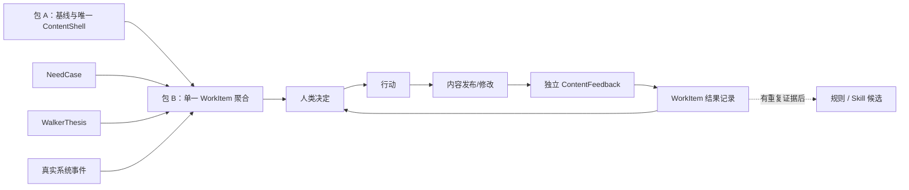

> **历史文档**：本文描述的是已退役的 Astro 单应用时代方案/记录。  
> **当前运行栈**见 `README.md`、`docs/architecture-modules.md`（React monorepo）。  
> 请勿按本文路径（`src/pages/*.astro`、`npx astro check`）施工。

# Hai Razor: Walker 后台与内容详情页第一实施包

## Verdict

- **Verdict**: 保留真实闭环，合并数据边界，延后规模化能力
- **One-line reason**: 当前计划保护了正确的业务区别，但把一个低流量个人系统过早拆成四套业务实体、多个阶段和 316 个并列勾选项，首包会很难得到一个可验证结果。
- **Razor principle used**: 只有删除后会破坏真实用户目标、事实可追溯性、安全边界或关键业务区别的概念，才值得在首包中独立存在。

## Audit Scope

- **Chain / targets**: 综合实施方案、综合可执行 To-do、详情页遗留计划，以及从需求/主张到决定、行动、内容反馈和结果的首个实现链路。
- **Current goal**: 用最少的新概念证明 Walker 能把一个真实输入转成可追踪行动，并从真实反馈得到下一步。
- **Not audited**: 最终视觉质量、17 个后台页面各自的信息架构、NorthStar 的商业模式、未来多租户规模与生产部署供应商选择。

## Evidence

| Source | What was seen | Supports / weakens which verdict | Confidence |
|--------|---------------|----------------------------------|------------|
| `npm test` | 23 个测试文件、160 个测试通过 | 现有服务/Store 基础值得复用 | High |
| `npx astro check` | 当前有 12 个错误 | G0 与 H0 不能跳过，必须合并为首个基线包 | High |
| `src/pages/admin/index.astro` | 决定、暂缓、AI 草稿仍写入三处 localStorage | 业务状态必须 Replace 为服务端事实 | High |
| `src/pages/api/match-feedback.ts` | 已有 MatchFeedback 的真实写入链路 | MatchFeedback 应 Keep，不应重造 | High |
| `src/pages/api/admin/hit-rate.ts` | 已从内容、Topic、NeedCase 计算结果 | 命中率应渐进扩展，不应整体重写 | High |
| `src/layouts/ContentShell.astro` 与 `src/components/blocks/ContentShell.astro` | 两套实现并存，真实路由只引用前者 | 重复实现应 Merge 后 Delete | High |
| 综合 To-do | 将 Evidence、Decision、Action、Outcome 分成独立类型、Store、Service、API | 语义区别值得保留，但四套独立持久化边界证据不足 | High |
| 用户陈述 | 明确要求真实数据、需求与个人主张分开、主题媒体可自定义、AI 与人双向赋能 | 核心区别 Keep；主题媒体 Keep in roadmap，但不进入首包 | High |
| 当前流量与角色 | 低流量、作者为主要管理员，Contributor 是未来角色 | 完整权限矩阵、多租户与复杂队列应 Defer | Med |

## Before / After

### Before

```mermaid
flowchart LR
  G0["G0 基线"] --> H0["H0 内容修复"]
  H0 --> P0A["事实源盘点"]
  P0A --> ER["EvidenceRef Store"]
  ER --> DI["DecisionItem Store"]
  DI --> AI["ActionItem Store"]
  AI --> OE["OutcomeEvent Store"]
  OE --> API["多组 Service / Admin API"]
  API --> WB["工作台迁移"]
  WB --> CF["ContentFeedback Store / API"]
  CF --> HR["Hit-rate 重算"]
  HR --> P2["P2 内容与资产"]
  P2 --> P3["P3 遥测与主题"]
  P3 --> P4["P4 AI 与 Contributor"]
  P4 --> P5["P5 NorthStar"]
```

### After

## Razor Map

| Concept | Claimed purpose | What concretely breaks if deleted | Hidden owner | Verdict | Reason |
|---------|-----------------|-----------------------------------|--------------|---------|--------|
| G0 可复现基线 | 区分旧问题与新回归 | 无法可信验收任何新改动 | 测试与执行记录 | Keep | 当前 `astro check` 已失败，证据充分 |
| H0 六项详情页清理 | 修复已知错误 | TOC 仍有真实故障与重复真相源 | G0 基线包 | Merge | 必须做，但无需作为独立产品阶段 |
| 独立 EvidenceRef 实体与 Store | 统一证据引用 | 证据引用语义会丢失，但不要求独立存储 | WorkItem.evidenceRefs | Merge | 保留语义，嵌入首个聚合即可 |
| 独立 DecisionItem 实体与 Store | 记录人类裁决 | 正式决定不可追溯 | WorkItem.decision 与事件历史 | Merge | 决定必须存在，独立仓储暂无必要 |
| 独立 ActionItem 实体与 Store | 管理执行 | 不能把决定变成动作 | WorkItem.actions | Merge | 允许一个 WorkItem 有多个动作，但共用事务边界 |
| 独立 OutcomeEvent 实体与 Store | 记录现实结果 | 无法闭环学习 | WorkItem.outcomes / event history | Merge | 结果语义必须保留，先与工作项同库 |
| WorkItem 事件历史 | 追踪 actor、时间和状态变化 | 无法审计、恢复或解释 AI/人的责任 | 无更合适所有者 | Keep | 这是信任边界，不是装饰字段 |
| NeedCase 与 WalkerThesis 来源区别 | 区分市场证据和作者主张 | 优先级和验证方式会被混淆 | WorkItem.sourceType | Keep | 用户明确要求，且影响决策解释 |
| MatchFeedback 与 ContentFeedback 区别 | 区分答案匹配结果和内容阅读结果 | 指标失真，动作归因错误 | 两套事件合同 | Keep | 生命周期与问题不同，不能合并 |
| ContentFeedback 独立写入链路 | 收集真实阅读结果 | 详情页无法给后台回传结果 | ContentFeedback service/store | Keep | 公共写入、量级和权限边界与后台 WorkItem 不同 |
| 工作台 localStorage 业务状态 | 快速保存决定/暂缓/草稿 | 删除后若无替代会失去状态 | WorkItem API | Replace | 责任真实，浏览器不是权威所有者 |
| 硬编码“系统可用” | 给管理员安全感 | 删除不破坏能力，只减少假信息 | 真实 Gateway health 或 unknown | Replace | 无真实适配器时显示“未知/未连接” |
| AI 自动排序和正式优先级 | 提高决策效率 | 当前删除不会破坏闭环 | 人类排序 + AI proposal | Prove first | 先证明建议能引用证据并提高决策质量 |
| 自动生成并注册 Skill | 资产化经验 | 首个内容闭环仍可完成 | 结果复盘后的候选队列 | Defer | 没有重复 Outcome 前无法证明规则稳定 |
| 完整浏览/停留/来源遥测 | 增加解释力 | 现有显式反馈闭环仍可成立 | 后续 telemetry adapter | Prove first | 先列出哪个决策确实缺哪个事件，再采集 |
| 自定义主题、图片和视频 | 个性化作者环境 | 不影响真实闭环，但会影响长期使用意愿 | 外观与媒体模块 | Defer | 用户明确需要，保留 P3，不进入数据首包 |
| 完整 Contributor 权限系统 | 支持未来协作 | 当前作者单人工作不受影响 | 现有 owner/admin 边界 | Defer | 先保持默认拒绝和角色占位，不实现矩阵 |
| NorthStar、交易、人与人匹配 | 形成公共经营网络 | Walker 个人闭环仍可独立成立 | 独立产品边界 | Defer | 必须等个人系统证明供给质量 |
| 全部 17 个后台页面重写 | 视觉与结构统一 | 核心闭环不依赖页面数量 | 共享壳 + 按真实工作流增页 | Delete | 页面数不是结果，先覆盖一条真实流程 |
| 第二套 ContentShell | 提供另一种阅读实现 | 真实路由不依赖它 | canonical ContentShell | Delete | 合并有价值差异并验证后删除重复文件 |

## To Cut or Merge

| Concept | Action | Strongest survival argument | Why it still falls short |
|---------|--------|-----------------------------|--------------------------|
| 四套独立实体/Store/Service | Merge | 未来可能独立查询、扩展和授权 | 当前没有不同生命周期、容量或权限证据；先保留语义而非物理边界 |
| H0 独立阶段 | Merge | 内容页清理与后台数据并非同一功能 | 它是进入实施前的质量门，合并进包 A 更容易完成和验收 |
| 17 页整体重写 | Delete | 一次统一可以避免旧页面继续漂移 | 会用页面完成度替代闭环完成度，且扩大脏工作树冲突面 |
| AI 正式排序 | Prove first | 没有排序，工作台仍可能有太多事项 | 先要求每个 AI proposal 给出 evidenceRefs、理由和置信度，由人决定 |
| 自动 Skill | Defer | 资产闭环是 Walker 长期差异化 | 一次成功不能证明可复用规则；至少需要重复结果和失败边界 |
| 全量遥测 | Prove first | 没有行为数据很难判断需求 | 先用显式需求与反馈完成闭环，只为已声明决策采集最小事件 |
| 主题媒体 | Defer | 用户已明确需要，且影响产品归属感 | 需求成立，但不应阻塞事实合同与反馈闭环 |
| Contributor / NorthStar | Defer | 越早设计越不容易返工 | 当前没有真实协作者/交易流程，提前实现只会冻结错误假设 |

## Complexity To Preserve

| Concept | Why preserved | Boundary that must not be mis-cut |
|---------|---------------|-----------------------------------|
| 人类最终决定 | 防止 AI 把推断伪装成事实或优先级 | AI 可提案、解释和草拟，不可静默进入正式队列 |
| 来源身份 | 用户需求与作者主张采用不同证据与验证方式 | 可以匹配，但不得抹掉原始来源 |
| 事件历史与 actor | 支持审计、恢复和责任解释 | 不能只保存 WorkItem 当前快照 |
| ContentFeedback 独立合同 | 公共写入与后台管理有不同权限、频率和滥用风险 | 不得直接复用 Admin WorkItem 写接口 |
| Match / Content 两类结果 | 两者回答不同问题 | 可在展示层并列解释，不合并原始分母 |
| 生产存储失败语义 | 防止静默退回内存制造假持久 | 开发可显式 memory，生产缺存储必须失败或标明降级 |
| 隐私与最小证据引用 | 后台需要追溯，但不应复制私密原文 | EvidenceRef 指向来源并保存安全摘要 |

## Shape After the Razor

第一实施包缩成两段：

1. **包 A：可信基线**——修复 12 个类型错误，确定唯一 ContentShell，完成 H0，标记旧计划为历史输入，解释 17/15 的索引差异。
2. **包 B：真实工作项薄切**——新增一个 `WorkItem` 聚合，而不是四套独立业务仓储；用它承载 evidence、decision、actions、outcomes 与 append-only history。先让一条真实 NeedCase 或 WalkerThesis 完成“人决定 → 行动 → 内容 → 独立内容反馈 → 结果”。

包 A 通过后才能开始包 B；包 B 通过前不扩展 P2—P5，也不重写其他后台页面。

## Risks & Guardrails

- **Likely rebound**: 后续开发者可能因查询方便重新拆出四套 Store，或把 AI 草稿直接当正式 WorkItem。
- **Mis-cut risk**: 把四个持久化边界合并时，不能顺手删除 evidence、decision、action、outcome 的语义区别和事件历史。
- **Guardrails**:
  - `WorkItem` 必须有 `sourceType`、`evidenceRefs`、`decision`、`actions`、`outcomes`、`history`。
  - 无 evidence 的 AI 输出只能是 `proposal`，不能进入 `decided/acting`。
  - 每次正式状态变化写 actor、时间、from/to 与 reason。
  - MatchFeedback 与 ContentFeedback 分开存储、分开计算、并列解释。
  - 生产缺少持久化依赖时不得静默使用内存。
  - 包 A 的四项门槛：`npm test`、`npx astro check`、`npm run build`、浏览器抽样。

## Next Steps

1. 立即执行包 A；这是本轮 `astro-component-diagnosis`、`hai-tdd` 与 Playwright 的范围。
2. 包 A 通过后，为 `WorkItem` 写状态机测试和存储合同测试，再实现 API 与工作台迁移。
3. 用一条真实 NeedCase 或 WalkerThesis 验收包 B，不用演示数据代替。
4. 只有当包 B 得到真实 ContentFeedback 和 Outcome 后，才评估 Skill、遥测、主题媒体与 Contributor 的下一优先级。

## HTML Artifact

- **Path**: `C:/Users/26296/AppData/Local/Temp/hai-razor-walker-admin/index.html`
- **When**: 本次属于结构性全审计，已生成 HTML 摘要。
- **Contents**: verdict、证据、前后结构、Razor Map、裁剪项、保留复杂度、风险与下一步。
