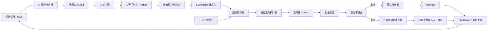

# AdgaiWalker AI 自媒体工作站 MVP 设计

日期：2026-08-04

状态：经第二轮对话确认，已补全调查、选题、行动排期和可加载工具架构，等待书面评审

目标：用最短路径验证“AI 协助调查问题和管理选题，作者提供核心观点与初稿，AI 再通过可替换的 Skill、MCP 和外部工具完成加工、封面、排版、发布与复盘”的单篇作品闭环。

## 1. 背景与目标

AdgaiWalker 已有以下经营内核：

```text
线索 Clue → 题苗 Seed → 执行 Execution → 交付与检验
```

公开站已有 `content/log` 内容真相源、Git 发布管线和 `iwalk.pro`。本 MVP 不重建第二套业务真相，而是在现有内核上增加一个本地 AI 自媒体工作站，覆盖一篇作品从问题调查到发布复盘的全过程。

作者负责：

- 补充自己观察到的真实问题；
- 在 AI 推荐中选定本次选题；
- 提供第一性原稿、项目资料和核心观点；
- 明确开始制作；
- 对最终成品做一次审批；
- 在个人主体公众号完成最终公开确认。

AI 负责：

- 从公开搜索、现有 Clue、用户反馈和作者输入中收集问题信号；
- 完成去重、聚类、用户场景、根因、证据和可验证性分析；
- 生成选题候选、评分、内容任务书和可自由排期的行动；
- 整理混合资料包；
- 从工具注册中选择和执行 Skill、MCP 或外部工具流水线；
- 在不改变核心观点的前提下重组结构、润色表达；
- 完成事实、隐私、夸大和格式检查；
- 生成网站稿、公众号稿和双封面；
- 发布网站；
- 在正常登录会话下辅助填写公众号；
- 记录已做和待做的图文、视频及其计划/实际日期；
- 收集发布结果，生成复盘建议并回写新的 Clue 和 Seed；
- 记录版本、结果、错误和恢复点。

## 2. MVP 成功标准

连续完成 3 个真实作品，并同时满足：

1. 每个作品可从真实问题或已有项目开始，有一份可追溯的调查摘要和选题记录；
2. AI 可以创建待办，但不写死截止时间；用户可随时调整、留白或勾选完成；
3. 每篇只需一次最终内容审批；
4. 原稿、工具加工过程、成品与发布版本可追溯；
5. 网站文章成功发布并能从正式地址访问；
6. 公众号草稿完成标题、摘要、正文、图片和封面填写，用户只需最终确认公开；
7. 任一阶段失败后可从最近成功阶段恢复；
8. 可在不修改业务流程代码的前提下，停用或替换一个工具执行器；
9. 3 篇中至少 2 篇无需人工返工 AI 加工流程。

## 3. MVP 边界

### 3.1 纳入

- 本地单人使用；
- AdgaiWalker Admin 作品入口；
- 问题信号收集、调查摘要和选题管理；
- 选题评分、去重、聚类和内容任务书；
- 可不填日期的行动清单、自由排期、勾选完成和视频日志；
- 文字、图片、视频、音频和链接组成的混合资料包；
- 用户原始文字稿或口播稿；
- 模板加 AI 路由的工具编排；
- Skill、MCP、本地/远程 Adapter 和 Recipe 的基础注册中心；
- 从本地路径、固定 Git 版本或 MCP 配置安装执行器；
- 网站 Markdown 成品；
- 微信公众号 HTML 成品；
- 3:4 竖版封面和 2100×900 微信横版封面；
- 一次最终审批；
- 网站自动发布；
- 微信公众号辅助发布；
- 本地版本、审计和失败恢复。

### 3.2 不纳入

- B站、小红书、抖音和 X 发布；
- 无确认公开发布；
- 绕过平台权限、验证码、风控或反滥用机制；
- 自动评论或私信回复；
- 完整客户、订单、报价和财务系统；
- 通用插件市场、付费、评论和自动推荐；
- 任意 GitHub 仓库下载后未审查直接运行；
- 完整容器沙箱和云端插件 Daemon；
- 多用户、云端队列和远程上传；
- AI 自主决定选题并直接公开；
- 删除线上内容；
- 复杂数据大屏。

## 4. 核心原则

1. **人负责观点和初稿，AI 负责调查辅助、加工与执行。** AI 可以生成调查报告和内容任务书，但不从零伪装成作者的人格表达。
2. **选定 Seed 或点击“开始制作”就是人工主选。** AI 可以调查、评分和推荐，但不擅自将候选题直接变成待发布作品。
3. **原稿永不覆盖。** 每个阶段只产生新 Artifact。
4. **一个事实一个真相源。** 问题在 Clue，选题在 Seed，项目与有用验证在 Execution，正文在 `content/log`，发布状态在 Publication。
5. **审批前不进入正式内容目录。** 只有批准版本可以写入 Git 管理的公开路径。
6. **外部工具无默认发布权。** 第三方 Skill、MCP 和 Adapter 只获得声明过的最小能力，发布器只消费已批准成品。
7. **平台失败不阻塞业务。** 网站与微信是独立发布任务。
8. **本地优先。** MVP 不先解决云端常驻、多人鉴权和分布式任务。
9. **业务阶段稳定，执行工具可替换。** 业务核心只依赖能力名和 Artifact 契约，不直接依赖某个 GitHub 项目的内部代码。
10. **安装不等于信任。** 新工具必须经过来源固定、清单检查、权限确认、健康检查和测试运行才能启用。
11. **排期是可选属性，不是系统强加的截止时间。** AI 生成的 Action 默认无日期，用户可自由安排或直接完成。

## 5. 系统总览



## 6. 与现有经营内核的连接

作品入口支持两种情况：

### 6.1 从新作品开始

用户上传资料并点击“开始制作”后，系统按幂等步骤编排：

1. 创建 `manual-self` Clue；
2. 将该 Clue 入池；
3. 创建 Seed；
4. 调用现有主选动作，将该 Clue 设为主线索，并由主选动作创建唯一 Execution；
5. 创建 Submission，并关联该 Execution。

按钮点击是人工主选授权，系统只是执行明确决定。每一步使用已创建对象的 ID 作为恢复点；中途失败后从缺失步骤继续，不重复创建对象。

### 6.2 连接已有项目

用户可在上传时选择已有 Execution。此时只创建 Submission，不创建新的 Clue、Seed 或 Execution。

### 6.3 从真实问题开始

除了直接上传初稿，用户也可以先输入一个模糊问题、搜索词、评论、私信摘要或自己的项目困难。系统：

1. 创建或关联 Clue；
2. 根据用户授权调用搜索、知识库或其他调查工具；
3. 形成结构化调查 Artifact，而不把 AI 推断当成已证实事实；
4. 与现有 Clue 和 Seed 去重、聚类；
5. 创建或更新 Seed；
6. 给出评分、证据缺口和建议表达形式；
7. 等待用户选定，不自动进入初稿制作。

调查 Artifact 至少包含：

- 谁在什么场景遇到了什么问题；
- 他原本想完成什么；
- 已尝试什么以及为什么失败；
- 可能原因，以及事实、他人观点和 AI 推断的分界；
- 搜索证据、反例和信息时效性；
- 已有内容的空白与作者可能的差异角度；
- 是否值得做成公开内容、服务或后续产品。

### 6.4 单篇作品标准流程

```text
问题信号收集
→ 问题调查与真实性分析
→ 选题去重、聚类与评分
→ 人工选定
→ AI 生成内容任务书和无日期 Action
→ 作者写核心观点和初稿
→ AI 整理、编辑、补证据与事实检查
→ 平台版本、封面、配图与排版
→ 人最终审批
→ 网站发布 + 公众号辅助填写
→ 发布结果、评论和数据回收
→ 复盘、拆条、再利用与新 Clue
```

### 6.5 人与 AI 责任边界

| 阶段 | AI 可以做 | 必须由人决定 |
|---|---|---|
| 调查 | 搜集、去重、聚类、标注证据和不确定性 | 是否认可这是真问题 |
| 选题 | 评分、排序、建议平台和表达形式 | 选哪个题、现在做不做 |
| 任务书 | 整理用户、问题、证据、结构和行动目标 | 要表达的核心立场 |
| 初稿 | 可提供资料和追问 | 作者自己完成观点和第一版表达 |
| 编辑制作 | 结构、润色、查错、排版、封面、平台改编 | 实质观点变更和最终成品审批 |
| 发布 | 网站推送、公众号填写和结果记录 | 公众号最终公开确认 |
| 复盘 | 聚合数据、评论、问题和再利用建议 | 是否调整定位、产品和长期方向 |

## 7. MVP 数据与存储

### 7.1 数据库新增对象

#### Submission

- `id`
- `executionId`
- `title`
- `inputMode`：`written`、`spoken` 或 `mixed`
- `outputTargets`：MVP 固定包含 `website` 和 `wechat`
- `status`
- `manifestPath`
- `createdAt`
- `updatedAt`

#### Publication

- `id`
- `submissionId`
- `channel`：`website` 或 `wechat`
- `artifactHash`
- `status`
- `url`
- `publishedAt`
- `lastError`
- `createdAt`
- `updatedAt`

#### Action

Action 是通用行动，既是备忘录，也是自由排期和视频日志的真相源。

- `id`
- `title`
- `note`
- `kind`：`research`、`topic`、`draft`、`production`、`video`、`publish`、`review` 或 `other`
- `entityType`：可为 `clue`、`seed`、`execution`、`submission` 或 `publication`
- `entityId`：可空，允许独立备忘
- `status`：`OPEN` 或 `DONE`
- `plannedDate`：可空，只表示想在哪天做，不代表硬截止时间
- `completedAt`：勾选完成时记录真实时间
- `source`：`human` 或 `ai`
- `createdAt`
- `updatedAt`

视频记录不另建孤立表：`kind=video` 的 Action 连接对应 Seed/Execution/Submission，`plannedDate` 回答“哪天要做”，`completedAt` 回答“哪天实际做了”。

#### ToolInstallation

- `id`
- `toolId`
- `kind`：`skill`、`mcp`、`adapter` 或 `recipe`
- `sourceType`：`local`、`git` 或 `remote`
- `source`：本地路径、Git URL 或 MCP 端点
- `pinnedVersion`：固定提交、版本或不可变摘要
- `manifestPath`
- `status`：`DISCOVERED`、`INSPECTED`、`DISABLED`、`ENABLED`、`UNHEALTHY` 或 `QUARANTINED`
- `approvedPermissions`
- `installedAt`
- `lastHealthCheckAt`
- `lastError`

MVP 不为每个工具阶段建立关系表；详细阶段记录保存在作品 manifest 中，缩短实现路径。调查报告、选题评分和内容任务书也以 Artifact 形式挂在 Clue/Seed/Execution 上，不另造一套业务真相。

### 7.2 本地作品目录

未批准作品保存在 Git 忽略目录：

```text
var/works/<submissionId>/
├─ original/       原稿和原始附件，只读
├─ research/       本作品引用的调查摘要、证据和内容任务书
├─ extracted/      转录、OCR、链接摘要
├─ stages/         每个工具阶段的加工版本
├─ final/          网站版、公众号版和封面
├─ publish/        发布包、截图和结果
└─ manifest.json   状态、版本、工具和审计记录
```

批准后，只有以下内容进入 Git：

- `content/log/<slug>.md`；
- `public/uploads/works/<submissionId>/...` 中被最终稿引用的公开素材；
- `apps/web/src/generated/content.json` 生成结果。

原始资料、临时文件、工具中间产物和私密素材不进入 Git。

### 7.3 工具目录

```text
var/tools/
├─ registry/               已检查的工具 manifest
├─ sources/<toolId>/       固定版本的外部源码或包
├─ runtimes/<toolId>/      独立依赖环境
├─ recipes/                业务配方
├─ credentials/            只由宿主读取的本地加密凭据引用
└─ runs/<runId>/            临时工作目录和脱敏日志
```

`var/tools` 整体不进入 Git；项目中只提交不含密钥的示例 manifest、Recipe 模板和锁定文件。

## 8. 状态机

### 8.1 调查与选题

Clue 和 Seed 沿用现有业务语义，MVP 只增加必要进度字段，不改变它们的真相所有权。

```text
Clue: CAPTURED → RESEARCHING → VALIDATED | REJECTED | NEEDS_EVIDENCE
Seed: INBOX → EVALUATED → READY → SELECTED | ARCHIVED
```

- `VALIDATED` 表示有足够证据进入选题池，不表示所有推断已成为事实。
- `SELECTED` 必须由用户动作产生；AI 只能将 Seed 推进到 `READY`。
- 选题评分变化不覆盖历史评分，保留评分版本和理由。

### 8.2 作品制作

```text
UPLOADED
→ EXTRACTING
→ PLANNING
→ PROCESSING
→ QUALITY_CHECKING
→ REVIEW_READY
→ APPROVED
→ PUBLISHING
→ PARTIALLY_PUBLISHED | COMPLETED
```

辅助状态：

- `NEEDS_INPUT`：缺少作者才能判断的信息；
- `CHANGES_REQUESTED`：最终审批退回；
- `FAILED`：自动重试后仍失败；
- `CANCELLED`：用户终止且不删除历史 Artifact。

允许的关键回路：

- 质量检查可退回最近的加工阶段；
- `NEEDS_INPUT` 获得答案后回到原阶段；
- 审批退回后从指定 Artifact 继续；
- 发布失败只重试对应 Publication，不重跑内容加工。

### 8.3 Action

```text
OPEN → DONE
DONE → OPEN
```

- 勾选时写入 `completedAt`；恢复未完成时清空 `completedAt`。
- 调整 `plannedDate` 不改变 Action 状态。
- AI 可以根据新的 Seed、Submission 和失败恢复需求创建 Action，但默认 `plannedDate=null`。

### 8.4 工具安装

```text
DISCOVERED
→ INSPECTED
→ DISABLED
→ ENABLED
→ UNHEALTHY | QUARANTINED
```

- 只有用户确认权限并通过健康检查后才能进入 `ENABLED`。
- 健康检查失败进入 `UNHEALTHY`；来源摘要异常、权限越界或安全检查失败进入 `QUARANTINED`。
- 运行中的作品继续锁定启动时的工具版本，不跟随后续升级。

## 9. 可加载工具与配方编排

### 9.1 编排方式

采用“稳定业务阶段 + 能力注册 + 基础配方 + AI 路由”：

- 每类作品有固定基础步骤；
- 步骤依赖能力名，例如 `research.problem`、`cover.vertical`、`layout.wechat` 和 `publish.website`；
- 工具注册中心把能力名解析到当前已启用的具体执行器；
- AI 可在配方允许的边界内建议增加、替换或跳过非必需步骤；
- 用户可以保存成功配方；
- 每次运行锁定工具版本，不在运行中自动更新。

### 9.2 单篇文章基础配方

```text
01 问题调查与证据摘要（可在选题时预先完成）
→ 02 内容任务书
→ 03 等待作者初稿
→ 04 资料归一化
→ 05 Walker 结构编辑
→ 06 个人语气保护
→ 07 事实、隐私与夸大检查
→ 08 冻结正文
→ 09 GBRO 封面策划
→ 10 双封面生成与检查
→ 11 网站 Markdown 生成
→ 12 gzh-design 基础排版
→ 13 小顽移动端优化
→ 14 HTML 与 390px 预览检查
→ 15 最终审批
→ 16 发布
→ 17 结果回收与复盘
```

以下步骤不可跳过：

- 保留原稿；
- 核心观点检查；
- 正文冻结；
- 事实和隐私检查；
- 最终审批。

### 9.3 工具类型

| 类型 | 用途 | MVP 运行方式 |
|---|---|---|
| `skill` | 指导 AI 如何做事的指令、参考和检查清单 | 宿主读取指令，不直接赋予额外权限 |
| `mcp` | 通过标准协议提供资源、工具和提示词 | 本地 STDIO 或明确允许的远程 HTTP |
| `adapter` | 包装普通 GitHub 项目、CLI、API 或浏览器操作 | 独立子进程或宿主受控 Adapter |
| `recipe` | 把业务阶段、能力、参数和人工门组成可复用流程 | YAML/JSON 配方，本身不持有外部权限 |

Skill 与 MCP 不互相取代：Skill 主要解决“怎样做”，MCP/Adapter 主要解决“可以调用什么外部能力”。

### 9.4 统一 manifest

每个可启用工具必须声明：

- `id`、名称、描述和类型；
- 来源 URL/路径、许可证和固定版本；
- 提供的 capability；
- 输入、输出 Artifact 类型和 schema 版本；
- 运行方式、启动命令或远程端点；
- 文件读写、网络域名、子进程、浏览器和凭据权限；
- 所需 credential 的引用名，不得包含真实密钥；
- 健康检查、超时、重试和失败分类；
- 是否可包含个人数据或将数据发往外部；
- 更新和回滚策略。

### 9.5 能力解析

配方不写死工具名，而是申请 capability。解析顺序：

1. 当前 Recipe 明确锁定的执行器；
2. Brand Profile 或工具中心中的用户默认执行器；
3. 已启用且健康、schema 兼容的优先级最高执行器；
4. 无匹配时进入 `NEEDS_INPUT`，不使用未启用工具。

每次解析结果都写入作品 manifest，包括选中理由、版本和权限快照。

### 9.6 独立工具执行器

MVP 使用适合 Windows 本地环境的轻量 Tool Runner：

- 每次运行创建独立临时目录；
- 只映射本阶段必需的输入 Artifact；
- 对子进程设置超时、输出上限和可终止机制；
- 网络访问仅限 manifest 声明并获批的域名；
- 真实凭据由宿主在运行时注入，不向工具暴露凭据库或其他凭据；
- 只接受符合输出 schema 的 Artifact；
- 返回脱敏日志、错误分类和输出哈希。

MVP 的轻量隔离不等于完整安全沙箱。因此，来源不明或需要广泛系统权限的 Adapter 不在 MVP 启用。

### 9.7 安装与升级流程

```text
选择本地路径 / Git URL / MCP 配置
→ 获取元数据，不运行代码
→ 固定提交或版本
→ 检查 manifest、许可证、依赖和权限
→ 展示风险摘要
→ 用户确认权限
→ 在独立运行环境安装
→ 健康检查和样例 Artifact 测试
→ 保持 DISABLED
→ 用户启用并可绑定默认 capability
```

升级创建新版本记录，不原地覆盖当前版本。新版本必须重新检查新增权限和回归测试；回滚只切换默认执行器，不删除历史运行记录。

### 9.8 工具执行契约

每个工具注册：

- 名称、来源、许可证和固定提交版本；
- capability、触发条件和输入要求；
- 输出类型；
- 允许修改范围；
- 完成检查；
- 重试和失败处理。

每次 Stage 运行记录：

- 工具名称、类型、capability 与版本；
- 输入和输出 Artifact 哈希；
- 开始与结束时间；
- 修改摘要；
- 检查结果；
- 错误和重试次数。

### 9.9 尚未安装外部工具时的退化方式

工作站不以“所有外部工具必须先到齐”为启动条件：

- Clue、Seed、Action、内容任务书和初稿上传在没有外部工具时仍可使用；
- 没有搜索能力时，调查阶段基于用户提供的资料产生调查计划和证据缺口，不伪造外部证据；
- 缺少某个制作 capability 时，对应 Stage 显示“可安装工具”或“手工完成并上传 Artifact”；
- 后续安装工具后，已有 Clue、Seed、Action 和作品不需迁移，只需重新解析尚未完成的 capability；
- 任何时候都允许将工具停用并回到手工 Artifact 接管。

## 10. 外部 Skill 与依赖

### 10.1 GBRO Cover Design

来源：<https://github.com/pyang5166/gbro-cover-design>

许可证：MIT

职责：读冻结正文，选择封面风格和标题，输出详细中文生图提示词。

注册 capability：`cover.plan`。

限制与适配：

- 原 Skill 只输出提示词，不直接生图；MVP 增加 Image Generator Adapter；
- 原 Skill 固定 3:4 竖版；MVP 使用相同主题和素材再生成一张 2100×900 微信横版，不做机械裁切；
- 原 Skill 每篇询问三轮；MVP 使用一次性 Brand Profile 自动回答，最终审批时展示选择结果；
- 生图后必须逐字检查中文标题，失败则重新生成。

### 10.2 gzh-design

来源：<https://github.com/isjiamu/gzh-design-skill>

许可证：AGPL-3.0-or-later

职责：将冻结 Markdown 转换为公众号兼容基础 HTML。

注册 capability：`layout.wechat.base`。

### 10.3 小顽公众号排版 Lite

来源：<https://github.com/cyberxiaowan/xiaowan-wechat-layout-skill>

许可证：AGPL-3.0-or-later

职责：在 `gzh-design` 之后执行首屏、章节层级、留白、重点句、证据型配图、断行、390px 预览和粘贴检查。

注册 capability：`layout.wechat.mobile`和 `layout.wechat.validate`。

适配原则：

- 正文冻结后才进入排版；
- 不允许排版阶段为视觉效果删改正文；
- 输出干净正文 HTML、预览复制版和发布稳定版；
- 公众号后台和手机预览是最终兼容性权威；
- 外部 Skill 作为独立运行时插件，不把其代码复制进 AdgaiWalker 核心；
- 上述两个 GitHub 来源在首次安装时固定到具体提交，后续更新走第 9.7 节的升级流程；
- MVP 为本地个人使用。未来若将 `gzh-design` 或小顽排版的 AGPL 组件修改后作为网络服务提供，必须在云化设计时重新审查源代码提供义务。

## 11. Brand Profile

首次运行建立一次性配置：

- 作者名、署名和简介；
- 公众号名称；
- 作者头像、品牌标识和可公开的人脸参考图；
- 默认封面风格；
- 背景、字体和字色偏好；
- 默认生图执行器；
- 公众号配色；
- 正文字号、颜色和行距；
- 默认 CTA；
- 不允许 AI 改变的表达原则。

敏感资产只保存本地，普通 Skill 不获得账号凭证。

## 12. 修改自由度与正文冻结

AI 修改自由度为 B：可以重组结构，但必须保留核心观点、事实立场和个人语言。

编辑阶段必须输出：

- 结构变化；
- 删除内容；
- 新增内容；
- 观点变化风险；
- 事实补充及来源。

冻结后：

- 封面与排版 Skill 将正文视为只读；
- 只有明确错别字、标点和已授权事实修正可以改变文字；
- 需要实质修改时退回编辑阶段，生成新的冻结版本。

## 13. 权限模型

| 能力 | Skill | MCP / Adapter | 编排器 | 发布器 |
|---|---:|---:|---:|---:|
| 读取当前阶段副本 | 是 | 按 manifest | 是 | 是 |
| 产生新 Artifact | 通过宿主 | 按 schema | 是 | 否 |
| 覆盖原稿 | 否 | 否 | 否 | 否 |
| 读取任意本地文件 | 否 | 否 | 否 | 否 |
| 访问外部网络 | 否 | 仅批准域名 | 否 | 平台所需 |
| 读取账号凭证 | 否 | 仅宿主注入的指定凭证 | 否 | 最小必要范围 |
| 调用浏览器 | 否 | 明确批准后 | 否 | 平台所需 |
| 写正式内容目录 | 否 | 否 | 否 | 审批后 |
| 推送网站 | 否 | 否 | 否 | 审批后 |
| 填写公众号 | 否 | 否 | 否 | 审批后 |
| 最终公开公众号 | 否 | 否 | 否 | 需用户确认 |
| 删除线上内容 | 否 | 否 | 否 | MVP 禁止 |

权限以“安装时最大授权 + 每次运行的实际最小授权”两层计算。工具新版本新增任何权限都要求重新确认。

## 14. 最终审批台

正常情况下只出现一次人工审批，页面同时展示：

- 原始稿；
- 最终正文；
- 主要结构修改；
- AI 新增、删除或改写的观点；
- 网站预览；
- 公众号 390px 长预览；
- 3:4 竖版封面；
- 2100×900 微信横版封面；
- 事实、隐私和夸大风险；
- 本次 Recipe、工具选择及固定版本。

用户操作：

- 批准并发布；
- 退回并输入一句修改意见；
- 选择历史 Artifact 恢复；
- 取消本次作品。

AI 只有在缺少作者本人才能判断的信息时提前打断，并且一次只问一个必要问题。

## 15. 网站发布设计

批准后，Website Publisher：

1. 将批准 Markdown 原子写入 `content/log/<slug>.md`；
2. 将批准素材复制到 `public/uploads/works/<submissionId>/`；
3. 校验本篇 frontmatter、slug、图片路径和站内链接；
4. 运行内容生成和网站构建；
5. 检查 Git 工作树，只允许本篇预期文件和生成 JSON 进入本次提交；
6. 如果存在其他内容改动，停止并进入 `NEEDS_INPUT`，不得顺手提交；
7. 使用独立提交信息提交并推送 `main`；
8. 等待 Vercel；
9. 校验正式 URL 的状态、标题、正文特征和资源；
10. 写入 Publication URL 和时间。

现有 `content:publish --push` 会按内容目录暂存变更，MVP 发布器必须在调用前增加预期范围检查，不能假设内容目录始终干净。

历史内容字段不齐不阻塞 MVP。发布门只校验本篇新内容；旧内容字段迁移另立任务。

## 16. 微信公众号发布设计

批准后，WeChat Assisted Publisher：

1. 使用发布稳定版 HTML；
2. 打开用户正常登录的公众号后台；
3. 新建图文草稿；
4. 填写标题、作者、摘要和正文；
5. 上传横版封面和正文图片；
6. 保存草稿；
7. 打开手机预览；
8. 停在等待用户最终公开确认；
9. 用户发布后记录实际链接和时间。

不实现或协助：伪造认证、破解验证码、规避风控或绕过平台权限。

## 17. 发布前硬检查

- 原稿存在且哈希未变化；
- 核心观点没有未说明的改变；
- AI 新增事实有来源或明确标记；
- 无私密资料泄露；
- Markdown 可构建；
- 网站素材没有本地临时路径；
- 公众号 HTML 无脚本、乱码和失效图片；
- 390px 预览无标题孤行、异常留白和错位；
- 两张封面中文标题逐字正确；
- 发布内容哈希等于批准 Artifact 哈希。

## 18. 失败恢复

- 单个工具 Stage 最多自动重试 2 次；
- 工具已禁用、不健康或无兼容版本时，保留当前 Artifact 并进入 `NEEDS_INPUT`；
- 缺少作者判断时进入 `NEEDS_INPUT`；
- 封面文字错误时只重跑对应封面；
- HTML 失败时只退回排版阶段；
- 网站推送失败时保留已批准成品，单独重试 Website Publication；
- 微信填写失败时停在微信任务，不影响网站；
- 每个阶段从最近成功 Artifact 继续，不重跑整条链；
- 失败日志不包含账号密码、Cookie 全文或私密原稿全文。

## 19. 测试与验收

### 19.1 规则测试

- AI 可以将 Seed 推进到 `READY`，不能自动进入 `SELECTED`；
- 没有证据的 AI 推断必须与已验证事实分开；
- AI 新建 Action 默认不含 `plannedDate`；
- Action 勾选和恢复可逆，并正确记录/清空 `completedAt`；
- 未批准不能进入发布状态；
- 状态只能按允许路径推进；
- Skill、MCP 和 Adapter 不能写正式内容目录；
- 发布器不能消费未批准 Artifact；
- 网站与微信状态互不覆盖。

### 19.2 内容加工工具测试

- 固定输入产生完整 Artifact；
- 每阶段记录工具版本、修改摘要和哈希；
- 冻结后排版不删改正文；
- 双封面标题一致且比例正确。

### 19.3 工具注册与隔离测试

- 缺少 manifest、固定版本或许可证的 Git 工具不能启用；
- 工具不能读取未映射文件或获得未授权凭据；
- 未批准网络域名的访问被拒绝并记录；
- 工具超时可终止，失败不污染上一个 Artifact；
- 输出不符合 schema 时不进入下一阶段；
- 升级新增权限必须重新确认；
- 禁用或回滚工具后，新作品正确解析到可用执行器，历史作品仍可追溯旧版本。

### 19.4 发布测试

- 使用测试文章完成网站构建但不推送；
- 使用公众号草稿完成填写但不公开；
- 模拟生图、排版、Git 推送和微信填写失败；
- 验证从最近成功阶段恢复。

### 19.5 真实验证

按第 2 节标准连续运行 3 篇真实作品，记录：

- 总耗时；
- AI 自动执行时间；
- 作者实际操作时间；
- 提前打断次数；
- 退回次数；
- 失败与恢复位置；
- 网站和微信最终结果。
- 从问题输入到人工选定的时间；
- AI 调查中被人判定为无效或错误的条目数；
- 每篇自动生成的 Action 数、被删除数和实际完成数；
- 工具解析、超时、失败和回滚次数；
- 作品发布后的首批数据、用户反馈和新 Clue 数。

## 20. 选题管理与内容任务书

### 20.1 选题库视图

选题库以 Seed 为真相源，而不再建一张与 Seed 并行的“选题表”。管理页至少提供：

- 收件箱：未完成调查和评估的 Seed；
- 候选池：已评分、可以人工主选的 Seed；
- 已选定：已进入 Execution 或等待作者初稿的 Seed；
- 已归档：不做、重复、过时或证据不足的 Seed；
- 聚类视图：按用户、问题、场景、内容支柱和来源聚类；
- 系列视图：显示母题与子题、图文与视频的派生关系。

### 20.2 选题评分

每次 AI 评分保留一份带理由的版本，不只保留总分：

| 维度 | 评估问题 |
|---|---|
| 真实性 | 是否有具体人物、场景和证据？ |
| 用户价值 | 能否解决一个可识别的真实问题？ |
| 时效与流量 | 是否正在被搜索、讨论或转发？ |
| 差异性 | 作者是否有自己的经验、比喻、项目或解释角度？ |
| 证据完整度 | 现有资料是否足以支撑可靠内容？ |
| 商业连接 | 是否可以连接服务、产品、客户或案例？ |
| 制作成本 | 在当前时间、素材和能力下是否能做好？ |

评分只用于排序和暴露取舍，不代替用户主选。

### 20.3 内容任务书

用户主选后，AI 产生一份等待初稿的任务书：

- 目标用户和具体场景；
- 用户当前状态、期望结果和核心阻碍；
- 作者必须自己回答的核心问题；
- 已知证据、反例和仍需核实的内容；
- 建议结构，但不生成伪装成作者的完整初稿；
- 建议内容形式和首发平台；
- 看完后希望用户理解或完成什么；
- 后续可验证的数据或“真实完成数”。

## 21. 行动板、自由排期与视频日志

### 21.1 视图

- **行动收件箱**：所有未排期、未完成 Action；
- **自由日历**：只显示已设 `plannedDate` 的 Action，支持拖动和清除日期；
- **今天/本周**：快速聚焦，不会因为过日期而自动标记失败；
- **已完成**：按 `completedAt` 回看实际做过什么；
- **视频日志**：同时展示待做视频和已做视频，并可打开对应 Seed、Execution 或 Submission。

### 21.2 AI 创建 Action 的边界

- 主选 Seed 后，AI 可以创建“写核心观点/初稿”Action；
- 流程需要作者补充时，AI 可以创建具体补充 Action；
- 发布后，AI 可以创建数据回看和复盘 Action；
- 所有 AI 创建的 Action 都显示来源和关联对象，可一键删除；
- AI 不创建硬截止时间，也不因用户未按计划执行而自动改变选题或作品状态。

## 22. 研究来源与架构取舍

本设计吸收以下开源项目的结构思路，但不将它们整套嵌入 AdgaiWalker：

- [Goose](https://github.com/aaif-goose/goose)：把 MCP 扩展与可复用 Recipe 分开，对应本设计的“能力执行器 + 业务配方”。
- [n8n Nodes Starter](https://github.com/n8n-io/n8n-nodes-starter)：通过标准包元数据注册节点和凭据，对应本设计的 manifest、版本锁定和 credential 引用。
- [Dify Plugin Daemon](https://github.com/langgenius/dify-plugin-daemon)：将插件生命周期与主应用分离。其完整 Daemon 对 Windows 并非开箱即用，因此 MVP 只实现轻量本地 Tool Runner。
- [Model Context Protocol](https://modelcontextprotocol.io/docs/develop/build-server)：优先使用标准 Resources、Tools 和 Prompts 接入可替换外部能力。
- [Langflow](https://github.com/langflow-ai/langflow)：将流程导出为 API/JSON/MCP 工具的思路，支持本设计将 Recipe 保持为可验证、可复用的独立对象。

不选择“扫描文件夹就直接运行任意脚本”的原因是：它无法稳定表达版本、许可证、输入输出、凭据需求和最小权限，会让后续的失败恢复和替换成本过高。

## 23. 实施切片

本设计是一个闭环，但实施时分为可独立验收的四个切片，避免一次开发过多子系统：

1. **经营入口：** Clue 调查 Artifact、Seed 选题库、内容任务书、Action 自由排期与视频日志。
2. **可加载执行层：** manifest、ToolInstallation、capability 解析、轻量 Tool Runner 和手工 Artifact 接管。
3. **作品制作：** Submission、作品目录、基础 Recipe、初稿后加工、双封面、公众号排版和最终审批。
4. **发布与复盘：** 网站发布、公众号辅助填写、Publication、首批数据/反馈录入和新 Clue 回写。

每个切片必须在进入下一个之前完成规则测试和一条真实数据的手工验收；最终再按第 2 节连续运行 3 篇作品。

## 24. MVP 后的扩展条件

只有在 3 篇真实作品通过后才考虑：

- 小红书、B站和抖音适配器；
- 硬时刻的定时发布；
- 全平台数据自动回收（MVP 只支持手工录入或当前已授权工具可读取的结果）；
- 评论与线索辅助处理；
- 云端常驻任务；
- 多用户；
- Outcome 商业验证和客户管理扩展。
- 完整插件市场、数字签名、容器沙箱和远程 Tool Runner。

扩展平台时继续复用同一个批准 Artifact，不复制第二套内容生产流程。
