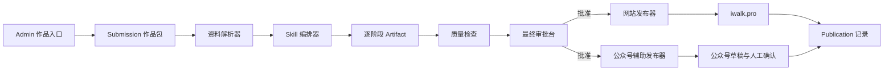

# AdgaiWalker AI 自媒体工作站 MVP 设计

日期：2026-08-04

状态：设计已在对话中逐段确认，等待书面评审

目标：用最短路径验证“作者提供原稿，AI 调用 Skill 完成加工、封面、排版与双端发布”的闭环。

## 1. 背景与目标

AdgaiWalker 已有以下经营内核：

```text
线索 Clue → 题苗 Seed → 执行 Execution → 交付与检验
```

公开站已有 `content/log` 内容真相源、Git 发布管线和 `iwalk.pro`。本 MVP 不重建第二套业务真相，而是在现有内核上增加一个本地 AI 作品工作站。

作者负责：

- 提供第一性原稿、项目资料和核心观点；
- 明确开始制作；
- 对最终成品做一次审批；
- 在个人主体公众号完成最终公开确认。

AI 负责：

- 整理混合资料包；
- 选择和执行 Skill 流水线；
- 在不改变核心观点的前提下重组结构、润色表达；
- 完成事实、隐私、夸大和格式检查；
- 生成网站稿、公众号稿和双封面；
- 发布网站；
- 在正常登录会话下辅助填写公众号；
- 记录版本、结果、错误和恢复点。

## 2. MVP 成功标准

连续完成 3 个真实作品，并同时满足：

1. 每个作品从后台上传混合资料包开始；
2. 每篇只需一次内容审批；
3. 原稿、Skill 加工过程、成品与发布版本可追溯；
4. 网站文章成功发布并能从正式地址访问；
5. 公众号草稿完成标题、摘要、正文、图片和封面填写，用户只需最终确认公开；
6. 任一阶段失败后可从最近成功阶段恢复；
7. 3 篇中至少 2 篇无需人工返工 Skill 流程。

## 3. MVP 边界

### 3.1 纳入

- 本地单人使用；
- AdgaiWalker Admin 作品入口；
- 文字、图片、视频、音频和链接组成的混合资料包；
- 用户原始文字稿或口播稿；
- 模板加 AI 路由的 Skill 编排；
- 网站 Markdown 成品；
- 微信公众号 HTML 成品；
- 3:4 竖版封面和 2100×900 微信横版封面；
- 一次最终审批；
- 网站自动发布；
- 微信公众号辅助发布；
- 本地版本、审计和失败恢复。

### 3.2 不纳入

- B站、小红书、抖音和 X 发布；
- 无确认公开发布；
- 绕过平台权限、验证码、风控或反滥用机制；
- 自动评论或私信回复；
- 完整客户、订单、报价和财务系统；
- 多用户、云端队列和远程上传；
- AI 自主决定选题并直接公开；
- 删除线上内容；
- 复杂数据大屏。

## 4. 核心原则

1. **人创作，AI 加工与执行。** 原稿和核心立场归作者，AI 不从零替代作者。
2. **上传并点击“开始制作”就是人工主选。** AI 不擅自将普通线索升级为项目。
3. **原稿永不覆盖。** 每个阶段只产生新 Artifact。
4. **一个事实一个真相源。** 问题在 Clue，选题在 Seed，项目与有用验证在 Execution，正文在 `content/log`，发布状态在 Publication。
5. **审批前不进入正式内容目录。** 只有批准版本可以写入 Git 管理的公开路径。
6. **Skill 无发布权。** 第三方 Skill 只加工副本，发布器只消费已批准成品。
7. **平台失败不阻塞业务。** 网站与微信是独立发布任务。
8. **本地优先。** MVP 不先解决云端常驻、多人鉴权和分布式任务。

## 5. 系统总览



## 6. 与现有经营内核的连接

作品入口支持两种情况：

### 6.1 从新作品开始

用户上传资料并点击“开始制作”后，系统按幂等步骤编排：

1. 创建 `manual-self` Clue；
2. 将该 Clue 入池；
3. 创建 Seed；
4. 调用现有主选动作，将该 Clue 设为主线索，并由主选动作创建唯一 Execution；
5. 创建 Submission，并关联该 Execution。

按钮点击是人工主选授权，系统只是执行明确决定。每一步使用已创建对象的 ID 作为恢复点；中途失败后从缺失步骤继续，不重复创建对象。

### 6.2 连接已有项目

用户可在上传时选择已有 Execution。此时只创建 Submission，不创建新的 Clue、Seed 或 Execution。

## 7. MVP 数据与存储

### 7.1 数据库新增对象

#### Submission

- `id`
- `executionId`
- `title`
- `inputMode`：`written`、`spoken` 或 `mixed`
- `outputTargets`：MVP 固定包含 `website` 和 `wechat`
- `status`
- `manifestPath`
- `createdAt`
- `updatedAt`

#### Publication

- `id`
- `submissionId`
- `channel`：`website` 或 `wechat`
- `artifactHash`
- `status`
- `url`
- `publishedAt`
- `lastError`
- `createdAt`
- `updatedAt`

MVP 不为每个 Skill 阶段建立关系表；详细阶段记录保存在作品 manifest 中，缩短实现路径。

### 7.2 本地作品目录

未批准作品保存在 Git 忽略目录：

```text
var/works/<submissionId>/
├─ original/       原稿和原始附件，只读
├─ extracted/      转录、OCR、链接摘要
├─ stages/         每个 Skill 的加工版本
├─ final/          网站版、公众号版和封面
├─ publish/        发布包、截图和结果
└─ manifest.json   状态、版本、Skill 和审计记录
```

批准后，只有以下内容进入 Git：

- `content/log/<slug>.md`；
- `public/uploads/works/<submissionId>/...` 中被最终稿引用的公开素材；
- `apps/web/src/generated/content.json` 生成结果。

原始资料、临时文件、Skill 中间产物和私密素材不进入 Git。

## 8. 状态机

```text
UPLOADED
→ EXTRACTING
→ PLANNING
→ PROCESSING
→ QUALITY_CHECKING
→ REVIEW_READY
→ APPROVED
→ PUBLISHING
→ PARTIALLY_PUBLISHED | COMPLETED
```

辅助状态：

- `NEEDS_INPUT`：缺少作者才能判断的信息；
- `CHANGES_REQUESTED`：最终审批退回；
- `FAILED`：自动重试后仍失败；
- `CANCELLED`：用户终止且不删除历史 Artifact。

允许的关键回路：

- 质量检查可退回最近的加工阶段；
- `NEEDS_INPUT` 获得答案后回到原阶段；
- 审批退回后从指定 Artifact 继续；
- 发布失败只重试对应 Publication，不重跑内容加工。

## 9. Skill 编排

### 9.1 编排方式

采用“基础模板加 AI 路由”：

- 每类作品有固定基础步骤；
- AI 可建议增加、替换或跳过非必需步骤；
- 用户可以保存成功配方；
- 每次运行锁定 Skill 版本，不在运行中自动更新。

### 9.2 固定流水线

```text
01 资料归一化
→ 02 Walker 结构编辑
→ 03 个人语气保护
→ 04 事实、隐私与夸大检查
→ 05 冻结正文
→ 06 GBRO 封面策划
→ 07 双封面生成与检查
→ 08 网站 Markdown 生成
→ 09 gzh-design 基础排版
→ 10 小顽移动端优化
→ 11 HTML 与 390px 预览检查
→ 12 最终审批
→ 13 发布
```

以下步骤不可跳过：

- 保留原稿；
- 核心观点检查；
- 正文冻结；
- 事实和隐私检查；
- 最终审批。

### 9.3 Skill 执行契约

每个 Skill 注册：

- 名称、来源、许可证和固定提交版本；
- 能力、触发条件和输入要求；
- 输出类型；
- 允许修改范围；
- 完成检查；
- 重试和失败处理。

每次 Stage 运行记录：

- Skill 名称与版本；
- 输入和输出 Artifact 哈希；
- 开始与结束时间；
- 修改摘要；
- 检查结果；
- 错误和重试次数。

## 10. 外部 Skill 与依赖

### 10.1 GBRO Cover Design

来源：<https://github.com/pyang5166/gbro-cover-design>

许可证：MIT

职责：读冻结正文，选择封面风格和标题，输出详细中文生图提示词。

限制与适配：

- 原 Skill 只输出提示词，不直接生图；MVP 增加 Image Generator Adapter；
- 原 Skill 固定 3:4 竖版；MVP 使用相同主题和素材再生成一张 2100×900 微信横版，不做机械裁切；
- 原 Skill 每篇询问三轮；MVP 使用一次性 Brand Profile 自动回答，最终审批时展示选择结果；
- 生图后必须逐字检查中文标题，失败则重新生成。

### 10.2 gzh-design

来源：<https://github.com/isjiamu/gzh-design-skill>

许可证：AGPL-3.0-or-later

职责：将冻结 Markdown 转换为公众号兼容基础 HTML。

### 10.3 小顽公众号排版 Lite

来源：<https://github.com/cyberxiaowan/xiaowan-wechat-layout-skill>

许可证：AGPL-3.0-or-later

职责：在 `gzh-design` 之后执行首屏、章节层级、留白、重点句、证据型配图、断行、390px 预览和粘贴检查。

适配原则：

- 正文冻结后才进入排版；
- 不允许排版阶段为视觉效果删改正文；
- 输出干净正文 HTML、预览复制版和发布稳定版；
- 公众号后台和手机预览是最终兼容性权威；
- 外部 Skill 作为独立运行时插件，不把其代码复制进 AdgaiWalker 核心；
- MVP 为本地个人使用。未来若将 `gzh-design` 或小顽排版的 AGPL 组件修改后作为网络服务提供，必须在云化设计时重新审查源代码提供义务。

## 11. Brand Profile

首次运行建立一次性配置：

- 作者名、署名和简介；
- 公众号名称；
- 作者头像、品牌标识和可公开的人脸参考图；
- 默认封面风格；
- 背景、字体和字色偏好；
- 默认生图执行器；
- 公众号配色；
- 正文字号、颜色和行距；
- 默认 CTA；
- 不允许 AI 改变的表达原则。

敏感资产只保存本地，普通 Skill 不获得账号凭证。

## 12. 修改自由度与正文冻结

AI 修改自由度为 B：可以重组结构，但必须保留核心观点、事实立场和个人语言。

编辑阶段必须输出：

- 结构变化；
- 删除内容；
- 新增内容；
- 观点变化风险；
- 事实补充及来源。

冻结后：

- 封面与排版 Skill 将正文视为只读；
- 只有明确错别字、标点和已授权事实修正可以改变文字；
- 需要实质修改时退回编辑阶段，生成新的冻结版本。

## 13. 权限模型

| 能力 | 加工 Skill | 编排器 | 发布器 |
|---|---:|---:|---:|
| 读取当前作品副本 | 是 | 是 | 是 |
| 产生新 Artifact | 是 | 是 | 否 |
| 覆盖原稿 | 否 | 否 | 否 |
| 读取账号凭证 | 否 | 否 | 最小必要范围 |
| 写正式内容目录 | 否 | 否 | 审批后 |
| 推送网站 | 否 | 否 | 审批后 |
| 填写公众号 | 否 | 否 | 审批后 |
| 最终公开公众号 | 否 | 否 | 需用户确认 |
| 删除线上内容 | 否 | 否 | MVP 禁止 |

## 14. 最终审批台

正常情况下只出现一次人工审批，页面同时展示：

- 原始稿；
- 最终正文；
- 主要结构修改；
- AI 新增、删除或改写的观点；
- 网站预览；
- 公众号 390px 长预览；
- 3:4 竖版封面；
- 2100×900 微信横版封面；
- 事实、隐私和夸大风险；
- 本次 Skill 配方及固定版本。

用户操作：

- 批准并发布；
- 退回并输入一句修改意见；
- 选择历史 Artifact 恢复；
- 取消本次作品。

AI 只有在缺少作者本人才能判断的信息时提前打断，并且一次只问一个必要问题。

## 15. 网站发布设计

批准后，Website Publisher：

1. 将批准 Markdown 原子写入 `content/log/<slug>.md`；
2. 将批准素材复制到 `public/uploads/works/<submissionId>/`；
3. 校验本篇 frontmatter、slug、图片路径和站内链接；
4. 运行内容生成和网站构建；
5. 检查 Git 工作树，只允许本篇预期文件和生成 JSON 进入本次提交；
6. 如果存在其他内容改动，停止并进入 `NEEDS_INPUT`，不得顺手提交；
7. 使用独立提交信息提交并推送 `main`；
8. 等待 Vercel；
9. 校验正式 URL 的状态、标题、正文特征和资源；
10. 写入 Publication URL 和时间。

现有 `content:publish --push` 会按内容目录暂存变更，MVP 发布器必须在调用前增加预期范围检查，不能假设内容目录始终干净。

历史内容字段不齐不阻塞 MVP。发布门只校验本篇新内容；旧内容字段迁移另立任务。

## 16. 微信公众号发布设计

批准后，WeChat Assisted Publisher：

1. 使用发布稳定版 HTML；
2. 打开用户正常登录的公众号后台；
3. 新建图文草稿；
4. 填写标题、作者、摘要和正文；
5. 上传横版封面和正文图片；
6. 保存草稿；
7. 打开手机预览；
8. 停在等待用户最终公开确认；
9. 用户发布后记录实际链接和时间。

不实现或协助：伪造认证、破解验证码、规避风控或绕过平台权限。

## 17. 发布前硬检查

- 原稿存在且哈希未变化；
- 核心观点没有未说明的改变；
- AI 新增事实有来源或明确标记；
- 无私密资料泄露；
- Markdown 可构建；
- 网站素材没有本地临时路径；
- 公众号 HTML 无脚本、乱码和失效图片；
- 390px 预览无标题孤行、异常留白和错位；
- 两张封面中文标题逐字正确；
- 发布内容哈希等于批准 Artifact 哈希。

## 18. 失败恢复

- 单个 Skill 最多自动重试 2 次；
- 缺少作者判断时进入 `NEEDS_INPUT`；
- 封面文字错误时只重跑对应封面；
- HTML 失败时只退回排版阶段；
- 网站推送失败时保留已批准成品，单独重试 Website Publication；
- 微信填写失败时停在微信任务，不影响网站；
- 每个阶段从最近成功 Artifact 继续，不重跑整条链；
- 失败日志不包含账号密码、Cookie 全文或私密原稿全文。

## 19. 测试与验收

### 19.1 规则测试

- 未批准不能进入发布状态；
- 状态只能按允许路径推进；
- Skill 不能写正式目录；
- 发布器不能消费未批准 Artifact；
- 网站与微信状态互不覆盖。

### 19.2 Skill 测试

- 固定输入产生完整 Artifact；
- 每阶段记录 Skill 版本、修改摘要和哈希；
- 冻结后排版不删改正文；
- 双封面标题一致且比例正确。

### 19.3 发布测试

- 使用测试文章完成网站构建但不推送；
- 使用公众号草稿完成填写但不公开；
- 模拟生图、排版、Git 推送和微信填写失败；
- 验证从最近成功阶段恢复。

### 19.4 真实验证

按第 2 节标准连续运行 3 篇真实作品，记录：

- 总耗时；
- AI 自动执行时间；
- 作者实际操作时间；
- 提前打断次数；
- 退回次数；
- 失败与恢复位置；
- 网站和微信最终结果。

## 20. MVP 后的扩展条件

只有在 3 篇真实作品通过后才考虑：

- 小红书、B站和抖音适配器；
- 定时发布；
- 数据自动回收；
- 评论与线索辅助处理；
- 云端常驻任务；
- 多用户；
- Outcome 商业验证和客户管理扩展。

扩展平台时继续复用同一个批准 Artifact，不复制第二套内容生产流程。
