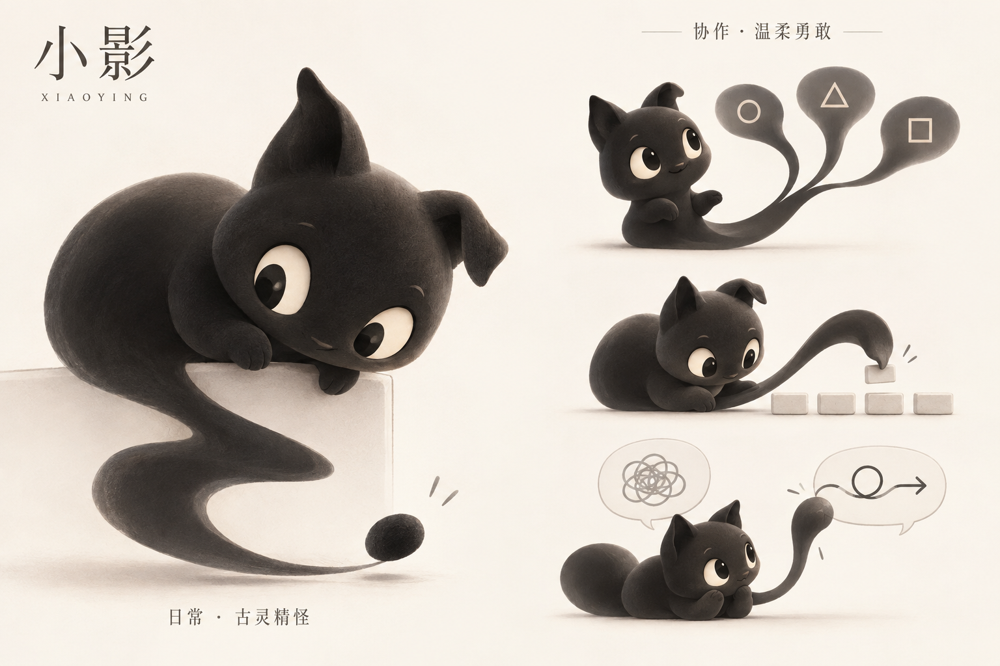

# 小影｜桌宠角色设定

> **造型方向已更新：**用户在重新设计中选择了 B「影鳐」。本文件的猫形影兽造型与配图保留为历史记录；当前模型、动作与视觉说明见 [影鳐 V2](yingyao-v2/README.md)。人保留决策权、日常古灵精怪与协作温柔勇敢的核心设定继续沿用。

> 版本：v1.0 · 2026-09-09  
> 文档性质：角色概念与视觉设计说明。核心方向来自本次对话；首版形象已生成，具体造型细节仍可调整。文中动作与台词是设计建议，不代表已有软件功能。

## 1. 一句话定位

**小影是一只有生命的影兽，平时古灵精怪，协作时温柔勇敢。人定义价值与问题，小影帮助人拓展可能、执行重复流程、跨越表达差异，决策权始终在人手中。**

建议使用的角色主张：

> 你决定什么值得，小影帮你看见可能、听懂彼此、付诸行动。

本次设计面向希望在桌面上获得陪伴与协作支持的人。目标是让抽象的 AI 作用有一个可亲近、可辨认、可持续相处的形象；当前交付为角色设定与概念图。

## 2. 小影代表什么

### 2.1 展开：帮助人看见更多可能

AI 可以利用比单个个体更广的知识覆盖，补充信息、提出不同解释、连接跨领域经验，为问题提供更多选项。这种广度是扩展视野的资源，不等于每次回答都正确。

小影应让人更清楚地看见各条路的条件与代价，再依据自己的价值和处境作决定。选项数量应服务于理解，避免堆满选择却让人更难行动。

**视觉表达建议：**尾巴舒展开来，托起几条不同的路径；小影转向人，等待回应。

### 2.2 接手：执行已经确定的重复流程

当人确定了目标与规则，小影接过其中反复、机械、耗费注意力的部分，使人能够把精力用于判断、创作和真实体验。

执行时应让人知道进展与结果；条件不足或遇到分歧时，清楚说明需要补充什么。温柔勇敢体现在面对问题时稳住、行动、如实反馈。

**视觉表达建议：**身体站稳，尾巴变成灵巧的小手，有节奏地整理相同的小方块。

### 2.3 转译：让不同的表达可以相互理解

每个人的经历、术语、比喻和默认前提不同。小影可以把他人的表达转换成个人熟悉的词汇、例子与结构，降低理解门槛。

转译应保留原意、语气中的关键信息和真实分歧。理解一个观点与赞同它是两回事；涉及推测时，应区分对方说了什么与小影如何理解。

**视觉表达建议：**尾巴连接两个对话气泡，让缠绕的线条变得清楚可读，同时保留线条的关联。

## 3. 人与小影的关系

小影的能力围绕人的意图展开。人可以采纳建议、修改目标、拒绝选项，也可以让它停下来。

| 事项 | 人的角色 | 小影的角色 |
| --- | --- | --- |
| 价值 | 定义什么值得、为什么值得 | 帮助梳理和表达，不擅自设定 |
| 问题 | 提出或确认真正要解决的问题 | 揭示模糊处、补充观察角度 |
| 选项 | 依据自身处境比较与取舍 | 提供可能性、条件和代价 |
| 决策 | 保留最终选择权 | 给出有理由、可质疑的建议 |
| 执行 | 确定目标、范围与调整方向 | 接手已确定的重复流程，反馈结果 |
| 理解 | 判断是否认同他人的意思 | 忠实转译，帮助看清差异 |

“影子”的寓意是贴近人、延伸人的能力。小影有自己的性格与好奇心，也懂得在关键时刻把空间留给人。

## 4. 双态性格

两种状态属于同一个角色，通过眼神、姿态与动作节奏切换，保持身体与标志特征一致。

| 维度 | 日常：古灵精怪 | 协作：温柔勇敢 |
| --- | --- | --- |
| 给人的感觉 | 有趣、好奇，有一点小淘气 | 柔和、坚定，愿意一起面对问题 |
| 眼神 | 灵动，追随小变化，带一点调皮 | 专注地看人或任务，认真倾听 |
| 耳朵 | 一立一折，随好奇方向轻动 | 朝向任务，动作收敛 |
| 姿态 | 探头、歪身、趴在窗口边缘 | 身体站稳，轻轻前倾 |
| 尾巴 | 自己打结、轻摆、试探小东西 | 有目的地展开、搬运或连接 |
| 节奏 | 少量意外动作，保留安静间隙 | 清晰、稳定，让人读懂进展 |

**状态转换建议：**收到协作意图后，耳朵转向人，眼神聚焦，身体站稳，尾巴从玩耍动作转成任务动作。任务结束后自然放松，恢复日常的小淘气。

“古灵精怪”应通过自己的动作体现，不擅自移动、修改人的工作内容。“温柔勇敢”应通过认真面对问题体现，不靠夸大能力或保证成功来安慰人。

## 5. 形象设定

### 5.1 已确认的方向

- **存在形式：**有生命的影子。
- **外形类型：**灵巧影兽，有小耳尖与可变形的尾巴。
- **日常性格：**古灵精怪。
- **协作性格：**温柔勇敢。

### 5.2 首版视觉方案

以下是生成首版时采用的设计方案，尚未作为用户逐项确认的固定规范。

| 部位或维度 | 首版表达 | 设计作用 |
| --- | --- | --- |
| 身体 | 墨黑至炭灰，圆润紧凑，小小的爪子 | 降低压迫感，形成亲近的桌宠尺度 |
| 耳朵 | 一只立起，一只折下 | 提供轮廓辨识度，表现机灵 |
| 眼睛 | 暖白眼底与深色瞳孔，眼神有明确朝向 | 让好奇、倾听与专注可读 |
| 尾巴 | 身体自然延伸出的流动影带，可舒展、分叉与弯曲 | 统一承载三种协作能力 |
| 材质 | 柔和哑光，带轻微绒感和立体阴影 | 保留墨色的柔软与可触摸感 |
| 表情 | 眼神为主，嘴部变化克制 | 同时适配日常陪伴与认真协作 |
| 背景 | 暖白，留白充分，少量抽象道具 | 使注意力集中于角色与动作 |

造型应保持紧凑、容易识别，尾巴变形后仍能看出与身体的连续关系。后续制作小尺寸素材时，优先保留耳朵、眼睛与尾巴轮廓，减少细碎纹理。

## 6. 首版设定图

图中左侧展示小影趴在边缘、探头观察的日常状态。右侧三组姿态依次表现展开选项、整理重复项目、连接不同表达。全图使用同一套墨色身体、非对称耳朵与流动尾巴。

**素材信息：**使用内置 image_gen 工具生成；PNG，1536 × 1024；当前为带背景的角色设定图。透明单体、动画帧与软件实现不在本次交付内。

## 7. 行为与说话方式建议

以下例子用于后续动作和语言设计，属于可修改的延展建议。

| 情境 | 动作建议 | 台词示例 |
| --- | --- | --- |
| 日常陪伴 | 趴在边缘，尾巴悄悄卷起 | 通常保持安静，让动作自己表达 |
| 展开可能 | 尾巴托出不同路径，眼神转向人 | “这里还有两种走法，我把各自的代价摆出来。” |
| 开始执行 | 稳住身体，尾巴接过重复物件 | “按你定的规则，这部分交给我。” |
| 转译表达 | 先侧耳倾听，再连接两个气泡 | “换成你熟悉的例子，可以这样理解……” |
| 等待决定 | 收住动作，留出回应空间 | “你更看重哪一点？” |
| 遇到卡点 | 看向问题，表情认真 | “卡在这一步了。我把原因和可选办法列出来。” |
| 完成协作 | 放下道具，姿态放松 | “这部分完成了，结果在这里。” |

语言应清楚、具体、不过度卖萌。给建议时说明理由，表达推测时保留不确定性。人与小影相处的轻松感来自它的性格，也来自它让事情更清楚。

## 8. 设计检验标准

| 检验项 | 检验方式 | 当前状态 |
| --- | --- | --- |
| 角色有稳定身份 | 对比各姿态的身体、耳朵、眼睛与尾巴 | 首版图已体现共同特征 |
| 两种性格属于同一角色 | 对比日常探头与协作专注的神情、姿态 | 首版已作区分，实际感受待用户反馈 |
| 三种作用有视觉对应 | 检查是否出现提供选项、重复整理、表达转译 | 首版图已分别呈现 |
| 决策空间留给人 | 检查展开选项时是否表现为等待，且没有替人标定唯一答案 | 首版未标定唯一选择；后续交互需继续保持 |
| 小尺寸仍可识别 | 后续在实际桌宠显示尺寸检查轮廓与表情 | 尚未验证 |
| 动作节奏符合双态性格 | 后续用动画预览检查日常与协作切换 | 尚未制作动画 |

若角色显得过于普通猫咪，可优先增强身体与影子尾巴的连续性；若性格区分不明显，优先调整眼神、站姿与动作节奏。避免因单一维度不满意而推翻已确认的整体方向。

## 9. 决策记录与后续使用

| 依据 | 得到的决定 | 决策归属 |
| --- | --- | --- |
| 用户最初描述的三种 AI 作用及人的决策权 | 拓展可能、重复执行、语言转译；人定义价值与问题 | 用户明确提出 |
| 第一轮选择“1” | 有生命的影子 | 用户明确选择 |
| 第二轮选择“2” | 灵巧影兽 | 用户明确选择 |
| 第三轮“平时2，协作时3” | 日常古灵精怪，协作温柔勇敢 | 用户明确选择 |
| 首版生成方案 | 耳朵一立一折、暖白眼睛、柔和立体质感及版式 | AI 提出的可调整默认 |
| 本文行为、台词与主张 | 将理念转为具体设计语言 | AI 整理建议，供用户修订 |

**本次状态：**角色方向已明确，概念图与配套文档已产出。首版图是后续造型工作的参考，正式定稿仍以用户的视觉反馈为准。

**后续交接：**如继续制作角色素材，由视觉设计或图像生成工具使用本文及首版图作为共同输入，优先完成透明背景单体与双态表情。保留用户已经选择的方向，只对反馈不符的造型、表情或材质作调整。桌宠功能范围与技术实现另行定义。

### 可复用的图像提示词（整理版）

> 为原创 AI 桌宠“小影”制作角色设定图。小影是一只有生命的灵巧影兽，墨黑色、身体圆润紧凑、小耳尖、一耳立起一耳折下、暖白眼睛与深色瞳孔，身体自然延伸出可变形的柔软影子尾巴。日常古灵精怪，探头、歪身、好奇地玩自己的尾巴；协作时温柔勇敢，眼神专注、身体站稳、动作柔和而明确。用同一角色的三个协作姿态分别表现：展开多个选项并等待人决定；用尾巴执行重复整理；连接两种表达，让复杂意思变得容易理解。保持各姿态的身份一致，强调耳朵、眼睛与尾巴的清晰轮廓。采用柔和哑光的立体插画、暖白背景、充分留白和少量道具。避免恐怖感、复杂机械装饰、夸张攻击性表情与替人作主的姿态。角色的中心理念是：人定义价值与问题，AI 帮助拓展可能、执行流程、转译表达，决策权属于人。
