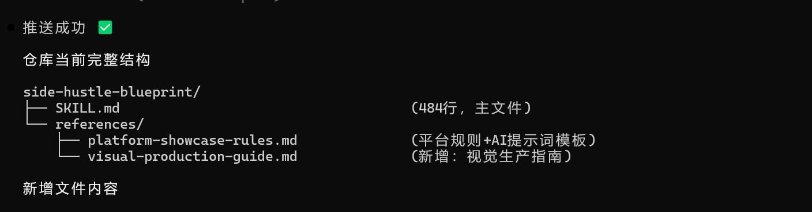

这两天为做内容做准备，网站功能、直播、某鱼、skill 测试、写教程，尤其是直播接触了人，原来不懂得，懂了挺多。在某一领域中，双方需求即存在——买卖、架构、光色，终归于人。但不止这些，还藏在矛盾主次中。但也有不懂的，这几天下来直播有了起色，也出现了买卖问题，这件事要去做，有人需要这些，同时我在思考如何定一个原则引导大方向。

今日凌晨，继续去做我的个人网站，又发觉一些东西，可能和 skill 形式表达的一样。

从始至终认为，和文字（符号）本身一样，文字穿越时空；而现在，文字有了力道。skill 是一个人经历的事情之后的经验、经验后的规律，靠文字承载的经验引导包，简单说就是一个人的经验包，用于让 AI 复现。

6 月 8 号下午近五点，做了一个副业 skill 观察发现，我对 skill 概念有了分层理解，skill 还连通着工具和知识库。"skill" 是一个人的经验判断。skill 不是单文件的提示词，是单个文件及背后的整个生态。所以我现在制作 skill 尽量的将 skill 主文件当做底线守门员及资源管家，引导 AI 帮助我决策，调用资源。那么我这个的价值范围在哪，能否进一步将我的网站整体作为工具，遇见某事就做成 skill，对社会、对个人、对世界做出不同的贡献。

于是去找高手。

9 号凌晨 1 点，"我比较怀疑是不是所有的东西都能做成一个 SKILL，但是大家好像觉得所有的东西一定能做成一个 SKILL，之前和你合作，你花了很多时间搓了一个 skill，但是其实并没有解决任何问题"海哥，我说"skill 对人有要求，文字本身（skill）对 AI 属于 harness 范畴"，我回"一个标准，一个结果"，海哥没听懂，话题截止。其实我想表达，标准在心中，做了就有结果，达到结果、没有达到标准是两码事。后续，海哥用他的写了一个写作 skill 告诉我，他不满意 AI 写的，不能一次达标；在 AI 写稿后他自己还要改——。我回想起，之前和于老的一夜谈，大概意思是一个结果在这儿达不成，那就在另一个范畴层面 ——领域范畴无法求解。定义域 x 以外的数值，不能产出值域以内的 y。

大致意思就是，海哥花时间实践了，从他的角度说不行，我说只是你可能在一个终究没有答案的地方转圈圈，没找到门路。但我也可能在自己的世界转圈圈。**站在错误的位置，实践→结果→永远够不着标准**，**不是标准的问题，不是努力的问题，是位置的问题。** 位置不仅仅指的是个人努力方向，还涉及当前科技发展是否满足条件。

只有实践出才能真知。试试吧，好奇的我。

最后，Skill 不是把经验写进去，而是把已经能稳定复现的经验封装成一个有边界、可调用、可验证的判断函数。我正在尝试将我的网站作为大本营，和 skill 相结合。

道不是先想出来的，道是在具体实践中走出来的；Skill 不是写出来的，是经验经过实践检验后凝结出来的。

6 月 9 日丙寅时 封键
一个 walker
